# Event Context

Framing notes on the historical episodes *Per la libertà!* dramatizes — the public history the memoir assumes its reader already carries. For each episode there are three voices, kept deliberately apart (see [the index](index.md) for the convention):

- **In the book** — how di Rudio and Crespi present the episode, anchored to the chapters where it appears. This is the memoir's account: partisan, Mazzinian, anticlerical, and hostile to the House of Savoy. It is reported here as the book's view, not as settled fact.
- **> Historical note** — external context, checked against outside sources before it is stated, so the reader can measure the memoir against the record. Where the two differ, the note says so.
- **> Scholarship** — what the standard academic literature on the episode adds: interpretation, scale, and the points where historians confirm, complicate, or contradict the memoir's partisan telling. Each names the work it draws on; full details are in [Sources & further reading](#sources--further-reading) below.

Citations use the summary's form — e.g. *P1 Ch. 6 (pp. 34–39)* — with pages keyed to the source scan.

---

## 1. The Austrian Settlement (1815–1847)

The whole memoir rests on a grievance it expects the reader to share: that after Napoleon's fall, Italy was handed back to foreign and clerical masters. Chapter 2 pauses the narrative to lay this out as di Rudio understood it.

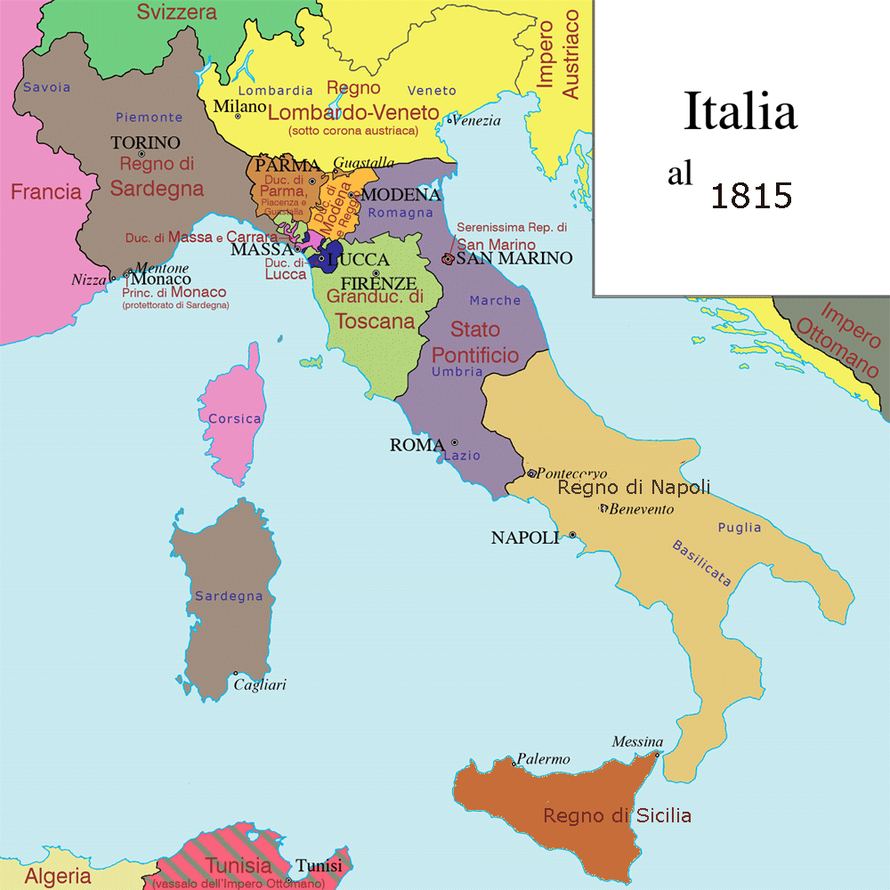

*Italy as the Congress of Vienna left it in 1815 — Austrian Lombardy–Venetia, the Papal States, the Kingdom of the Two Sicilies, Sardinia-Piedmont, and the duchies. Map: bramfab, Wikimedia Commons, CC BY-SA 3.0.*

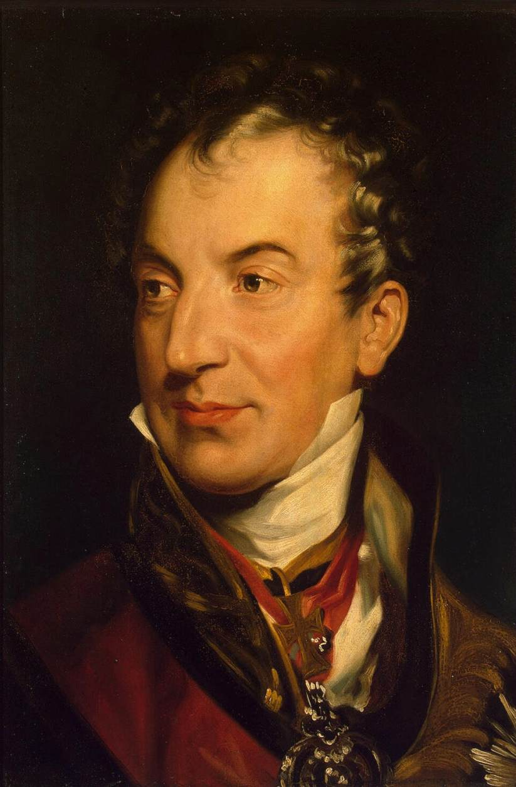

*Klemens von Metternich, architect of the post-1815 Austrian order in Italy — portrait by Sir Thomas Lawrence, c. 1815. Wikimedia Commons; public domain.*

**In the book.** di Rudio gives a compressed, furious history of "the Italian question." Metternich, having helped topple Napoleon, redrew the peninsula at Vienna into a cluster of restored princes — Ferdinand at Naples, Pius VII at Rome, the "executioner" Francesco IV at Modena — whom di Rudio calls Austria's "hired assassins," bound to Vienna by secret treaties that licensed armed intervention against any liberal stirring. He catalogues the machinery of repression: the Spielberg fortress in Moravia, the swarm of informers who "violated the postal secret" and reported even a man's choice of hat, the fiscal bleeding of Lombardy-Venetia, and the tobacco and cloth boycotts that the authorities answered with the knife. The chapter is also where di Rudio plants his own lineage: an ancient Belluno family; a father who smashes a bust of "the liberating Pontiff" Pius IX in a café, crying that the citizens carry "the greatest enemy of our Fatherland"; a maternal grandfather, Fortunato de Domini, who was himself a colonel of Austrian infantry. *(P1 Ch. 2, pp. 15–23)*

> **Historical note** — The Congress of Vienna (1814–15) restored Austrian predominance over Italy: Lombardy and Venetia were annexed directly to the Habsburg Empire as the Kingdom of Lombardy–Venetia, while restored dynasties ruled the rest under Austrian influence. The dismissive tag "Italy is a geographical expression" is traditionally attributed to Metternich. *(Source: Wikipedia, "Kingdom of Lombardy–Venetia"; "Klemens von Metternich".)*

> **Scholarship** — Christopher Duggan (*The Force of Destiny*, 2007) stresses that the Restoration after 1815 forced patriots into secret societies, and that Italian nationalism in these decades remained a minority cause — confined to a thin stratum of intellectuals, artists, and professionals, with regional loyalties still predominant. The memoir's vision of a Fatherland uniformly groaning for unity is the committed activist's; most contemporaries were not yet "Italians" in di Rudio's sense.

---

## 2. The Five Days of Milan (March 1848)

di Rudio's war begins here, as a cadet who cannot fight yet.

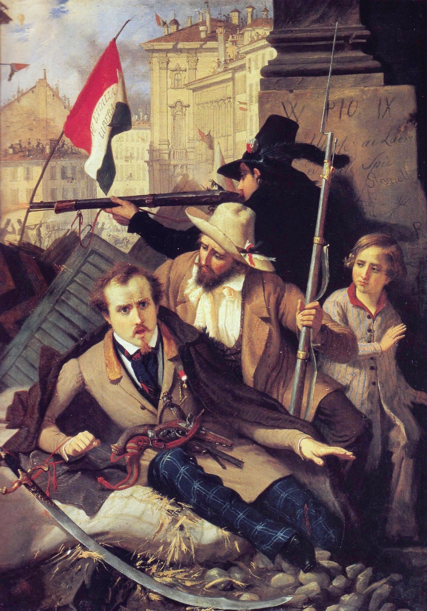

*The Five Days of Milan, March 1848 — "Episode of the Five Days," painting by Baldassare Verazzi (before 1886); a depiction of the event, not a contemporary sketch. Wikimedia Commons; public domain.*

**In the book.** He is a student at the San Luca military academy in Milan when the city rises on 18 March 1848. He describes a spontaneous insurrection — "no plan long prepared, no understanding among the citizens" — touched off by news of Vienna's upheaval and the fall of Metternich; a city of "a hundred and sixty thousand" turned into "one terrible unity"; more than a thousand barricades thrown up overnight from paving stones, furniture, and mattresses; women and children carrying powder and hurling roof tiles. Inside the academy the cadets are first told the rising is the work of "a handful of brigands," then fall silent as the truth arrives. On the fourth day the garrisons within the Naviglio surrender and Radetzky is forced into a "dissembled but precipitous" retreat; a committee of citizens comes to the college to send the Milanese cadets home. di Rudio's account dwells, in his partisan key, on Austrian atrocities during the withdrawal. *(P1 Ch. 2, pp. 15–23; the retreat atrocities are detailed in P1 Ch. 3, pp. 23–26)*

> **Historical note** — The Five Days of Milan (18–22 March 1848) drove Marshal Radetzky's Austrians from the city; over 400 Milanese were killed and some 600 wounded. On the evening of 22 March Radetzky withdrew eastward to the "Quadrilateral" fortresses (Verona, Legnago, Mantua, Peschiera). The next day, 23 March, Charles Albert of Sardinia-Piedmont declared war on Austria, opening the First Italian War of Independence — which, after Austrian victories at Custoza and Novara, ended within a year in the restoration of Lombardy–Venetia to Austria. *(Source: Wikipedia, "Five Days of Milan"; "First Italian War of Independence".)*

> **Scholarship** — Lucy Riall (*Risorgimento: The History of Italy from Napoleon to Nation-State*, 2009) treats 1848 as a watershed in the *politicization* of ordinary Italians — the social ferment that made later unification thinkable. Paul Ginsborg, historian of the parallel Venetian revolution, judged the lasting "failure" of 1848 to lie in the choice of so many revolutionaries to subordinate radical republican and democratic aims to national unification — the very subordination di Rudio would spend his life protesting.

---

## 3. The Roman Republic and Its Siege (1849)

The first defeat that the book treats as a victory of spirit — and di Rudio's baptism in battle.

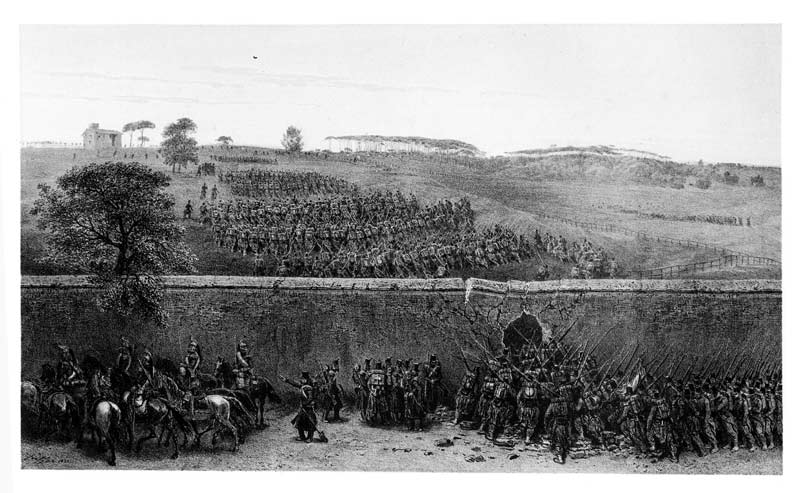

*The attack on the Villa Pamphili during the siege of Rome, 3 June 1849 — drawing by Auguste Raffet; a contemporary depiction. Wikimedia Commons; public domain.*

**In the book.** After the collapse of 1848 in the north, di Rudio reaches Rome with Garibaldi's Legion. He sees the French under General Oudinot repulsed at the walls on 30 April 1849, and claims the republicans could have driven them into the sea had Mazzini not "blunted our élan" for diplomatic reasons. He fights at Palestrina against the Neapolitan "Re Bomba" (9 May) and at Velletri, where his band of "beardless youths" rescues a fallen Garibaldi and earns the famous "fatherly cheek-pinch." The set piece is 3 June 1849: Oudinot, "adding treachery to treachery," breaks the armistice and seizes the Villa Pamfili and the Villa Corsini — "the key to Porta San Pancrazio." The chapter renders the day-long, doomed assaults on the Corsini in near-liturgical terms: Manara's Bersaglieri cut down on the slope, the Dandolo brothers, the heroic charge and death of Angelo Masina, the wounding of the poet Goffredo Mameli. In a personal interlude di Rudio captures a French officer hiding in a privy and, at the Ponte San Sisto, physically shields him from National Guardsmen who mean to shoot him and throw him in the river — "I will not permit the Italian name to be dishonored by acts of cowardice." *(P1 Ch. 6, pp. 34–39; see also P1 Ch. 4, pp. 26–31, and P1 Ch. 7, pp. 39–43)*

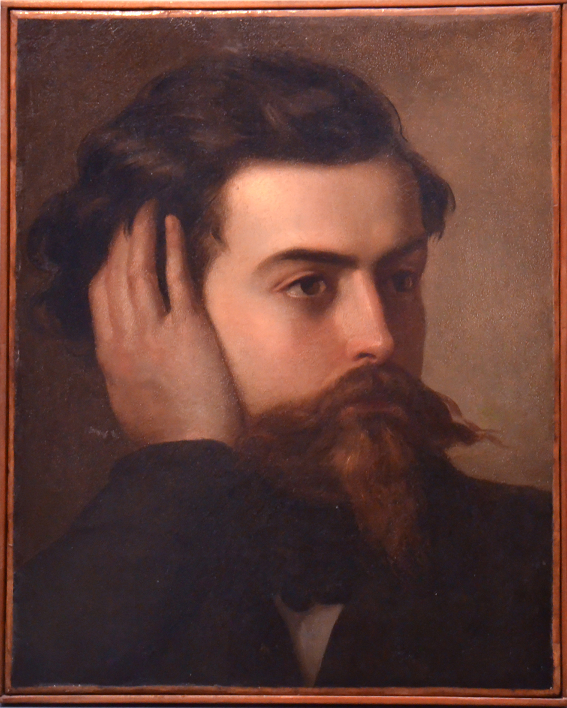

*Goffredo Mameli, poet of the Roman Republic, mortally wounded in the 1849 siege di Rudio describes — portrait by Domenico Induno, c. 1849. Wikimedia Commons; public domain.*

> **Historical note** — The Roman Republic was proclaimed in February 1849 after Pius IX fled the city; it was governed by a triumvirate including Mazzini and defended by Garibaldi. A French expeditionary force sent by Louis-Napoleon besieged the city; after heavy fighting on the Janiculum in June, the Assembly ceased resistance on 1 July and French troops entered Rome on 3 July 1849, restoring papal rule. Goffredo Mameli, author of what is now the Italian national anthem, died of his wound that July. *(Source: Wikipedia, "Roman Republic (1849)"; "Goffredo Mameli".)*

> **Scholarship** — G. M. Trevelyan's *Garibaldi's Defence of the Roman Republic* (1907) remains the classic English narrative of the siege; he gives a full chapter to "The Third of June — Villa Corsini" and an appendix to the numbers of killed and wounded, ranking the doomed assaults di Rudio describes among the costliest and most celebrated feats of the defense. Trevelyan's frankly heroic, literary manner runs strikingly close to the memoir's own register.

---

## 4. The Coup d'État of Louis-Napoleon (December 1851)

The episode that fixes Napoleon III as the book's master-villain, and that di Rudio witnesses from a Paris barricade.

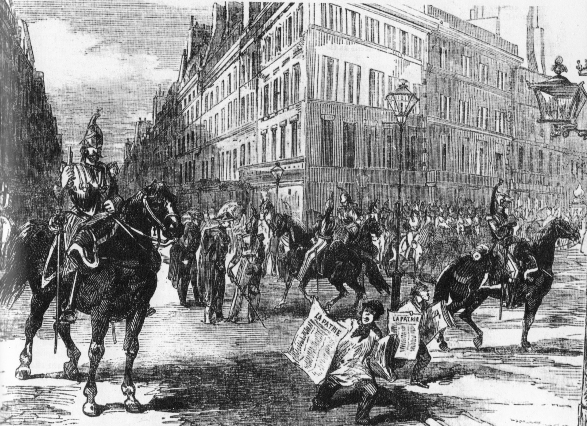

*Louis-Napoléon's cavalry in the streets of Paris during the coup of December 1851 — contemporary engraving, 1851. Wikimedia Commons; public domain.*

**In the book.** Exiled in Paris, di Rudio and a comrade make cartridges for the Club of Batignolles. On 2 December 1851 they find the Place de la Bastille under arms; warning the affiliated clubs, they help raise a barricade at the Club of Saint-Denis — "sixteen Frenchmen and two Italians" behind a red kerchief tied to a stick. The chasseurs of Vincennes "attempted twice and twice repulsed"; on the third rush they close ranks, scale the barricade, and "found not a living creature before them" — the defenders, their last cartridge spent, having slipped away. di Rudio then narrates the coup at large in his polemical voice: generals arrested in their beds, the presses seized, the boulevard massacre fueled by distributed brandy, prisoners shot in batches over twelve nights and buried with their heads above ground for identification, and the Mixed Commissions condemning men in absentia to Lambessa or "the dry guillotine of Cayenne." He records, too, the republicans' fatal scruple — Victor Hugo and the Left who would raise barricades but recoil from striking at the one man, Louis-Napoleon himself. *(P1 Ch. 9, pp. 48–52)*

> **Historical note** — Louis-Napoleon Bonaparte, President of the Second Republic, seized absolute power by coup on 2 December 1851; resistance in Paris and the provinces was crushed and thousands were arrested, deported, or killed (exact tolls remain disputed). Exactly one year later, on 2 December 1852, he was proclaimed Emperor Napoleon III, inaugurating the Second Empire. The memoir's charge that he murdered his elder brother is not supported by the historical record. *(Sources: Wikipedia, "French coup d'état of 1851"; "Second French Empire"; "Napoleon III".)*

> **Scholarship** — Ted Margadant (*French Peasants in Revolt: The Insurrection of 1851*, 1979) shows that the gravest resistance to the coup came not from Paris but from a wave of provincial, largely peasant insurrection across central and southern France — a new form of popular political participation, answered with mass arrests. di Rudio's Saint-Denis barricade was a real but minor episode beside that rural rising; roughly two hundred were killed in the Paris streets on 4 December alone.

---

## 5. The Conspiratorial Decade — Giovine Italia, the 1853 Rising, and the Belfiore Martyrs

The long middle of Part One: the underground years that made di Rudio a professional conspirator and cost his mentor Calvi his life.

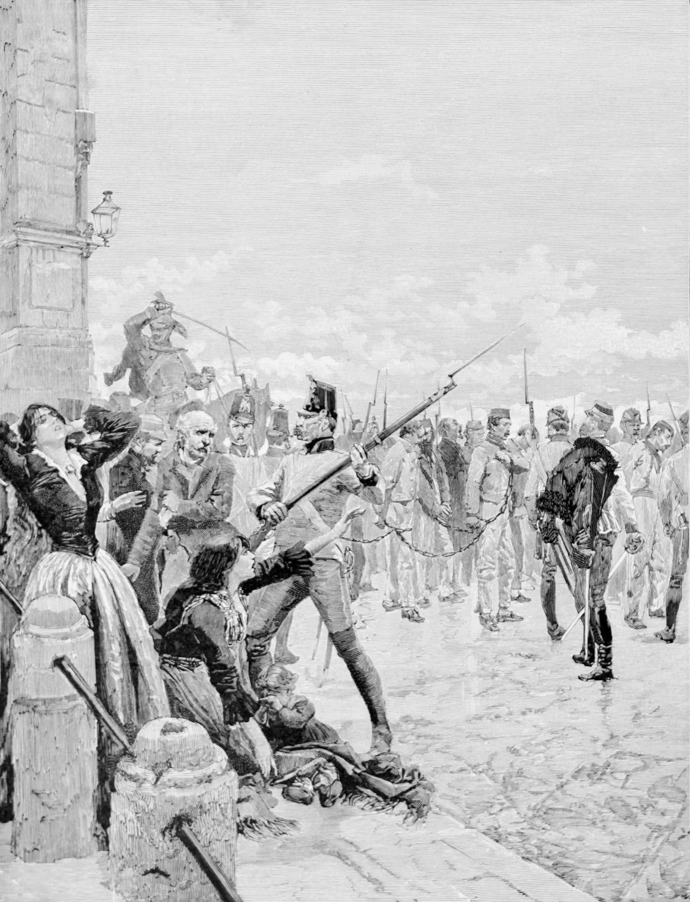

*"The Belfiore martyrs led to the scaffold" — the patriots Austria hanged at Mantua, 1852–55, among them di Rudio's mentor Calvi. Commemorative wood engraving by Edoardo Matania, 1887. Wikimedia Commons; public domain.*

**In the book.** Driven from France, di Rudio swears Mazzini's oath and enters *Giovine Italia* (Young Italy). Back in Genoa (1852), working for a merchant tailor, he is drawn again into action by the patriot priest Don Bastiano Barozzi and by his old colonel Pietro Fortunato Calvi, who commissions him a secret envoy into Austrian Lombardy-Venetia under the alias "Carlo Moretti, a silk merchant" — coding regiments as bales of silk. The chapters trace the Mazzinian European Revolutionary Committee, the abortive Milan rising of 6 February 1853 (di Rudio, carrying gold for Calvi's Lake Maggiore scheme, is recalled with the word "In Milan all is lost"), his first meeting with Mazzini near Lugano, the doomed Alpine conspiracy around Belluno, and Calvi's capture. The book makes Calvi's death its moral peak: he refuses to beg the clemency Austria reserved for the repentant and goes to the gallows with studied composure. *(P1 Ch. 11–16, pp. 59–83; Calvi's capture, P1 Ch. 22, pp. 108–112)*

> **Historical note** — Mazzini founded *Giovine Italia* in 1831 to work for a unified Italian republic. The Milan insurrection of 6 February 1853, a Mazzinian rising, was suppressed within a day. Pietro Fortunato Calvi, taken by the Austrians in 1853, was hanged at Mantua on 4 July 1855 — counted among the Belfiore martyrs, the patriots executed at Mantua between 1852 and 1855. *(Sources: Wikipedia, "Giuseppe Mazzini"; "Belfiore martyrs".)*

> **Scholarship** — Denis Mack Smith (*Mazzini*, 1994) confronts the standard charge that Mazzini was a futile dreamer whose conspiracies led the Italian Left up a blind alley. Most of those conspiracies did fail — and "could hardly help but fail," Mack Smith concedes — yet he argues that their constant pressure, and Mazzini's tenacity across the defeats of 1831–1859, kept the cause of a united Italy alive, as even his opponents privately admitted. The memoir's adoration of the Maestro has a serious scholarly defense beneath it.

---

## 6. The Orsini Attentat (14 January 1858)

The event the book exists to re-litigate: the bombing that di Rudio helped carry out, and for which he was nearly executed.

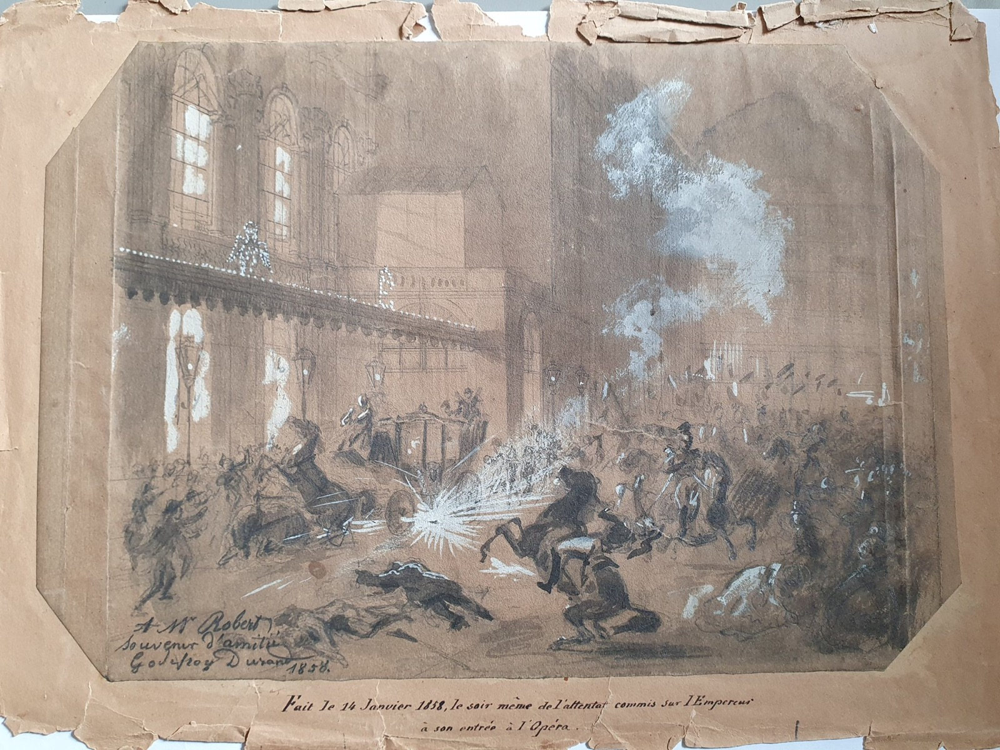

*The bombs thrown at Napoleon III's carriage outside the Salle Le Peletier, 14 January 1858 — drawing by Godefroy Durand, made the very evening of the attack. Bibliothèque-musée de l'Opéra (via Wikimedia Commons); public domain. A contemporary depiction.*

**In the book.** In September 1857, in Nottingham, di Rudio aids a passing Italian exile who mentions him to Felice Orsini at Birmingham; Orsini — "the very man I am looking for!" — summons di Rudio to London by letter and revives a plan to kill Napoleon III. Orsini lays out a sweeping political rationale (a blow in Paris to topple the Empire, free France, and unbar Italy), insists the conspirators not know one another, and routes the operation through the London-based physician Simon Bernard. di Rudio crosses to Paris on a Portuguese passport as "Giovanni da Sylva"; at Orsini's lodgings he meets the servant Antonio Gomez (whom he at first takes for the Englishman "Allsop") and the Tuscan Giuseppe Pieri. The book is careful with the mechanics of the fulminate: di Rudio spreads the damp explosive on a newspaper while **Orsini** runs his fingertips over it to judge its moisture and takes the dangerous drying upon himself. On the evening of 14 January 1858, outside the Opéra, the bombs are thrown — Gomez's first, prematurely, then di Rudio's. *(P2 Ch. 5–10, pp. 144–165)*

> **Historical note** — On 14 January 1858 three bombs were thrown at Napoleon III's carriage outside the Salle Le Peletier; the Emperor and Empress were unhurt, but about eight people were killed and some 150 wounded. Orsini and Pieri were guillotined on 13 March 1858. The attack's longer consequence was diplomatic: though historians doubt Orsini's appeal swayed Napoleon directly, the Emperor met Cavour secretly at Plombières on 21 July 1858 and pledged French arms against Austria — the bargain that produced the Second War of Italian Independence in 1859. *(Sources: Wikipedia, "Orsini affair"; Britannica, "Felice Orsini".)*

> **Historical note** — di Rudio's most explosive claim surfaced not in the book but in his 1908 *San Francisco Call* interview: he named **Francesco Crispi** — the future prime minister of united Italy — as present at the attentat. Half an hour before the attack, he said, a "man with long mustaches" exchanged a low word with Orsini at the corner of the Rue Le Peletier; *"That's Francesco Crispi,"* di Rudio told Orsini, who replied "with a slight tinge of irritation." Since it was never established who threw the third (unexploded) bomb, di Rudio left the inference that Crispi did. The claim caused a stir and was promptly doubted — Crispi was indeed arrested in Paris that night but released the next day — and no historian accepts that he took part in the bombing. *(Source: [San Francisco Call, 29 Sept. 1908](sources/1908-09-29_sf-call.md); the credibility dispute is the subject of the 30 September follow-up discussed in [Themes §1](themes.md#1-testimony-as-method--the-human-document).)*

> **Scholarship** — Michael St John Packe's *The Bombs of Orsini* (1957) is the standard English history of the plot, and it confirms the British dimension the memoir takes for granted: the bombs were manufactured in Birmingham and a British passport supplied (by Thomas Allsop), Orsini had toured Britain as a celebrity lecturer, and the conspirators lived in England known as language teachers — precisely di Rudio's world of Nottingham lessons and London exiles.

---

## 7. The French Penal Colony of Guiana (1858–1859)

The book's descent into hell — and the stage for di Rudio's escape.

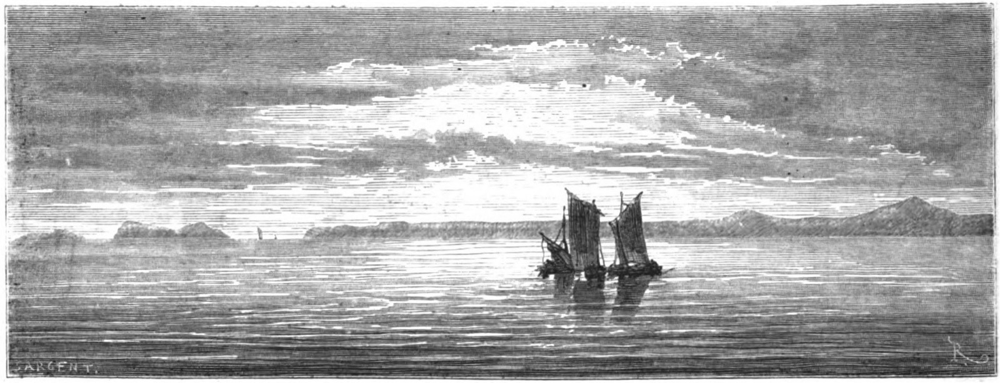

*The Îles du Salut — the French Guiana penal-colony archipelago — seen from the open sea. Wood engraving after Édouard Riou, 1866 (Le Tour du monde). Wikimedia Commons; public domain.*

**In the book.** Spared the guillotine, di Rudio is shipped to French Guiana aboard the convict transport (the *Durance*), put ashore by way of the Île Royale du Salut, and landed on 11 December 1858 at the Montagne d'Argent, a former plantation turned penal station near the Brazilian frontier. He describes forced labor in the forest, a commandant who promises him he will "leave his skin" there, and his own resolve to escape: with eight accomplices he secretly fells and hollows a great tree into a canoe. Then yellow fever sweeps the colony. di Rudio buries the dead "one by one," his eight fellow escape-plotters among them; of "more than six hundred souls" only sixty-three survive, and the survivors — di Rudio one of only three wholly untouched by the fever — are evacuated to the Île du Salut. There he plans a second, successful escape: seizing a fishing boat and scuttling the pursuit craft. *(P2 Ch. 21–22, pp. 212–222; the escape, P2 Ch. 25–27, pp. 228–240)*

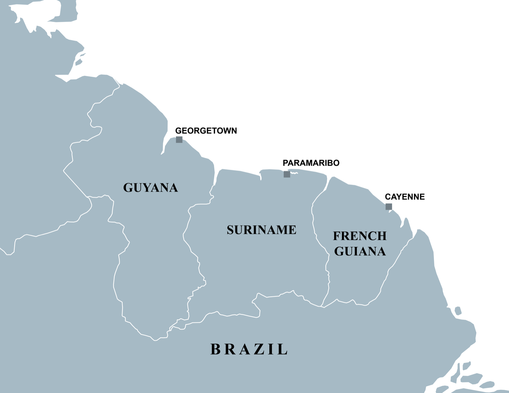

*The three Guianas — di Rudio's escape ran from Cayenne and the Îles du Salut (French Guiana, far east) northwest along the coast through Suriname to British Guiana (now Guyana), where he made landfall near the Berbice. Map: SurinameCentral, Wikimedia Commons, CC BY-SA 4.0.*

> **Historical note** — Napoleon III established the penal colony of French Guiana (the *bagne de Cayenne*, centered on the Salvation Islands — Île Royale, Île Saint-Joseph, and the Île du Diable, "Devil's Island") by decree in 1852; it operated until the 1950s and was notorious for a death rate driven by tropical disease. The phrase "dry guillotine" (*la guillotine sèche*) — which the memoir already uses for Cayenne in 1858 — became the popular name for the colony, fixed by escaped convict René Belbenoît's 1938 book of that title. *(Source: Wikipedia, "Devil's Island".)*

> **Scholarship** — Stephen Toth (*Beyond Papillon*, 2006) and Peter Redfield (*Space in the Tropics*, 2000) document the system di Rudio survived: Guiana was chosen in 1852 despite a climate so lethal with yellow fever that it had long repelled free settlers, in the hope that convict labor might develop it, and transportation was institutionalized by the law of 1854. Toth's portrait of an uncaring administration, brutal guards, and a death rate that made Guiana the deadliest of the French *bagnes* renders di Rudio's epidemic and his "you will leave your skin here" commandant representative, not exceptional.

---

## 8. Unification — From Plombières to the Kingdom of Italy (1858–1861)

The making of Italy, watched bitterly from exile by a republican who thinks it was made the wrong way.

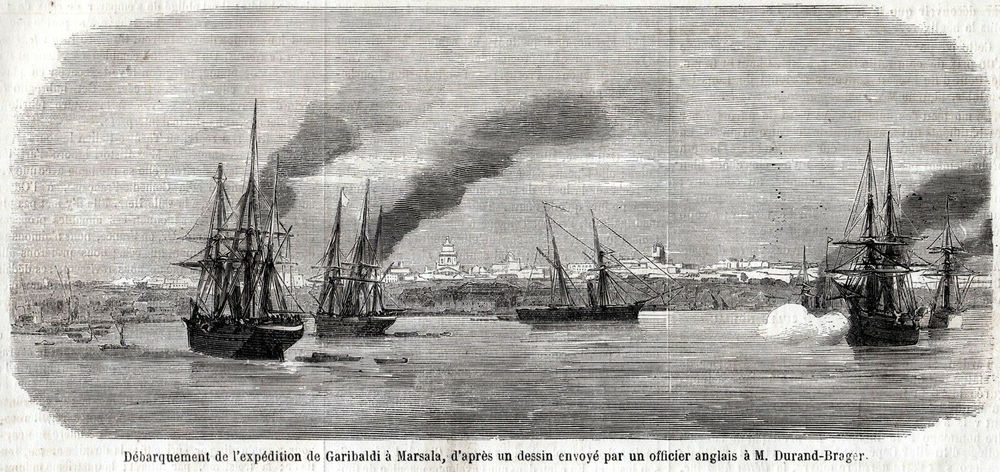

*Garibaldi's Thousand landing at Marsala, May 1860 — a contemporary eyewitness drawing. Wikimedia Commons; public domain.*

**In the book.** Returned to London, di Rudio follows unification through the English press and judges it by Mazzinian lights. He condemns the 1859 alliance of Piedmont and Napoleon III, the "treacherous peace of Villafranca" that left Venetia to Austria, and above all the cession of Nice and Savoy — "the full price paid for a service only partially rendered." He hails Garibaldi's landing at Marsala and the victory of Calatafimi, but insists the Expedition of the Thousand was *organized* by Mazzini, Rosalino Pilo (who died in it), Agostino Bertani, and Nino Bixio, the glory of execution falling to Garibaldi. He notes, with sardonic relish, that Francesco Crispi contributed "a conspicuous supply — of Orsini bombs." Throughout, his target is the "practical" monarchy: Cavour the convert to revolution-from-above, Vittorio Emanuele the "vassal of the Empire." *(P2 Ch. 31, pp. 253–258)*

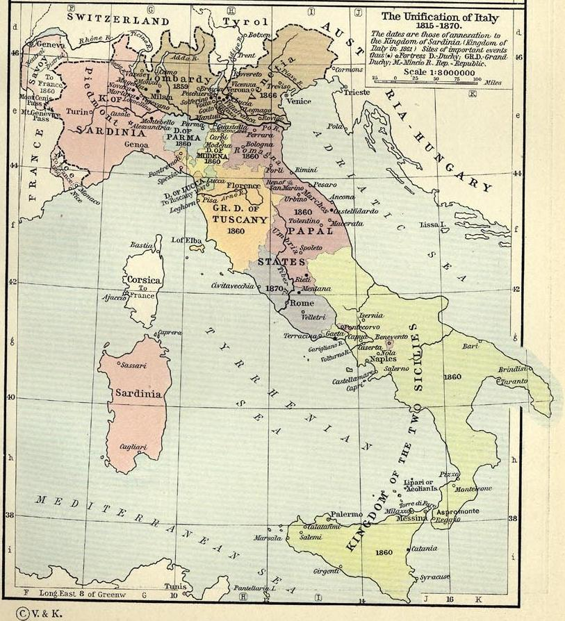

*The making of Italy, 1815–1870 — the stages by which the peninsula was unified, the process di Rudio watched from exile and judged a betrayal of its republican makers. From Shepherd's *Historical Atlas*, 1911. Wikimedia Commons; public domain.*

> **Historical note** — At Plombières (21 July 1858) Napoleon III and Cavour secretly agreed that France would help Piedmont expel Austria from northern Italy in exchange for Nice and Savoy. The Second War of Independence (1859) followed; Napoleon's separate armistice at Villafranca left Venetia with Austria. By the Treaty of Turin (24 March 1860) Sardinia ceded Nice and Savoy to France. Garibaldi's Expedition of the Thousand (sailed from Quarto, landed at Marsala, May 1860) toppled the Kingdom of the Two Sicilies, and the Kingdom of Italy was proclaimed on 17 March 1861 — still without Rome or Venetia. *(Sources: Wikipedia, "Treaty of Turin (1860)"; "Expedition of the Thousand"; "Unification of Italy".)*

> **Scholarship** — Denis Mack Smith (*Cavour*, 1985), long known for deflating the heroic-nationalist myth, reads Plombières as opportunistic power politics: a war engineered for territorial gain, with Piedmontese hegemony placed above any democratic or federal vision of Italy. That cool verdict converges, from the opposite political pole, with di Rudio's own republican indictment of the monarchy's "practical" unification.

---

## 9. Aspromonte (1862)

The wound that rouses di Rudio from his post-prison "torpor" — and the book's proof that the monarchy would shoot its own liberator.

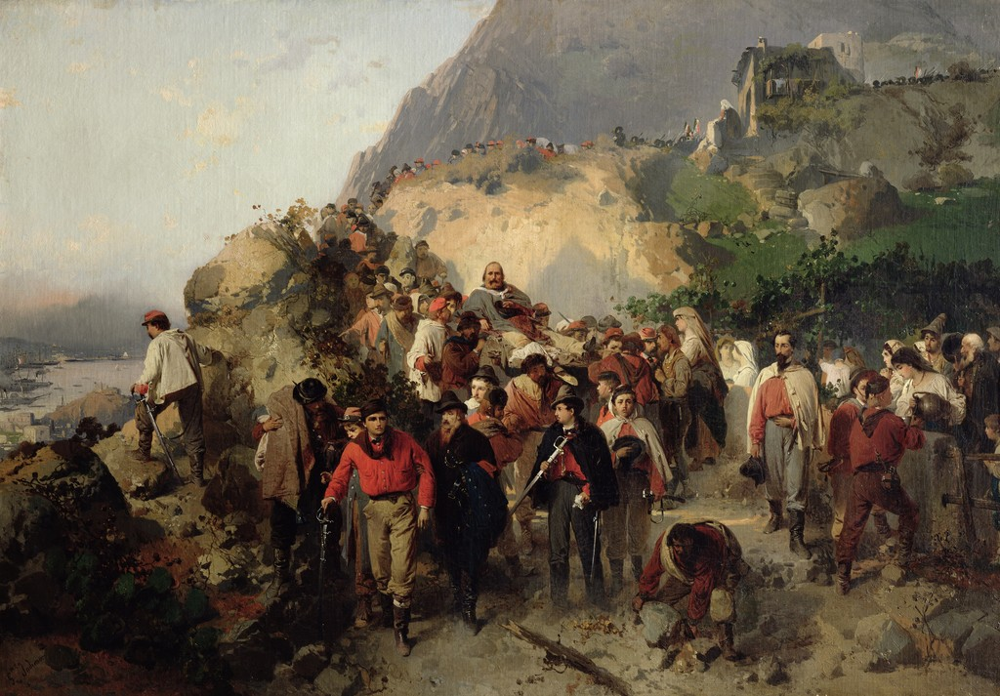

*Garibaldi wounded at Aspromonte, August 1862 — painting by Gerolamo Induno, c. 1863; a contemporary depiction. Museo Civico Revoltella, Trieste (via Wikimedia Commons); public domain.*

**In the book.** Garibaldi, having taken up the cry "Roma o morte" (Rome or death), marches up through Calabria toward the capital; at Paris the answer is "You shall have death, not Rome," and Napoleon imposes on Vittorio Emanuele "the part of the modern Cain." When the royal Bersaglieri meet the Garibaldian legion on 28 August 1862 (the book's date), Garibaldi orders his men not to fire; he is shot in the ankle and falls "at the foot of a tree which resurgent Italians ought to regard as sacred." The book frames the affair as a near-assassination of "the first, the most beloved among the fighters for the cause of Italy," foiled only by a sergeant who deliberately fired wide. *(P2 Ch. 31, pp. 253–258; its aftermath in London, P2 Ch. 33, pp. 264–268)*

> **Historical note** — At the Battle of Aspromonte (29 August 1862 — the memoir dates it 28 August), Italian royal troops halted Garibaldi's volunteer march on Rome and wounded him in the foot; he was briefly taken prisoner and then amnestied. *(Source: Wikipedia, "Battle of Aspromonte".)*

> **Scholarship** — Lucy Riall (*Garibaldi: Invention of a Hero*, 2007) argues that Aspromonte, far from dimming Garibaldi's image, burnished it — casting him as the victim of "coldhearted diplomats, insensitive generals, spineless politicians, and a corrupt clergy" — and that Garibaldi was himself complicit in the making of his cult. This both explains the near-sacred pitch of di Rudio's account and supplies the critical distance the memoir lacks.

---

## 10. The Risorgimento Exile and America (1864)

The book's close: a republican shut out of the nation he helped make, sent by his dying master across the Atlantic.

**In the book.** Roused by Aspromonte, di Rudio throws himself into London meetings against the Temporal Power, carrying the "O Roma o Morte" banner. He tries to sail home on an Italian warship offering free passage to returning exiles, but the consul Corti — after he gives his name as Carlo Nosadano — denies him a place and warns that within the Kingdom he would be seized and "handed over to the French authorities." Turning then toward Poland, di Rudio is summoned instead to a last meeting with a gravely ill Mazzini, who dissuades him from the "lost cause" of Poland and urges him toward the American war "for the abolition of slavery," writing him a letter of commendation he would keep for life. On 8 February 1864 di Rudio sails from Liverpool aboard the steamship *Virginia* for New York. The book ends on his lifelong exile's grief: "my Fatherland I have never seen again!" *(P2 Ch. 33, pp. 264–268)*

> **Historical note** — The memoir ends in 1864; the historical "Charles DeRudio" went on to serve in the Union Army and then the U.S. 7th Cavalry, surviving the Battle of the Little Bighorn (1876) and dying at Pasadena, California, in 1910 — three years before this book appeared. That later life is set out in the [Timeline](timeline.md). *(Source: Wikipedia, "Charles DeRudio".)*

> **Scholarship** — Maurizio Isabella (*Risorgimento in Exile*, 2009) recovers the émigré networks — London above all — as engines of a "liberal international," Italian exiles in sustained exchange with British, continental, and American thinkers rather than mere refugees marking time. di Rudio's London years, and his Mazzini-blessed departure for the American war against slavery, are nodes in exactly that transnational web.

---

## Sources & further reading

External facts in the **Historical note** callouts are checked against general reference works (Wikipedia, Britannica) before being stated; the **Scholarship** callouts draw on the standard academic literature listed here. None of these works treats *Per la libertà!* itself — they are the historical record against which the memoir is read.

- **Christopher Duggan**, *The Force of Destiny: A History of Italy Since 1796* (Allen Lane, 2007) — narrative history of the Restoration and Risorgimento.
- **Lucy Riall**, *Risorgimento: The History of Italy from Napoleon to Nation-State* (Palgrave Macmillan, 2009); and *Garibaldi: Invention of a Hero* (Yale University Press, 2007).
- **Paul Ginsborg**, *Daniele Manin and the Venetian Revolution of 1848–49* (Cambridge University Press, 1979) — the standard study of the 1848–49 revolutions in the Veneto.
- **George Macaulay Trevelyan**, *Garibaldi's Defence of the Roman Republic* (Longmans, Green, 1907) — the classic English narrative of the 1849 siege.
- **Ted W. Margadant**, *French Peasants in Revolt: The Insurrection of 1851* (Princeton University Press, 1979) — the standard account of resistance to Louis-Napoleon's coup.
- **Denis Mack Smith**, *Mazzini* (Yale University Press, 1994); and *Cavour* (Weidenfeld & Nicolson, 1985).
- **Michael St John Packe**, *The Bombs of Orsini* (Secker & Warburg, 1957) — the standard English history of the 1858 plot.
- **Stephen A. Toth**, *Beyond Papillon: The French Overseas Penal Colonies, 1854–1952* (University of Nebraska Press, 2006); and **Peter Redfield**, *Space in the Tropics: From Convicts to Rockets in French Guiana* (University of California Press, 2000).
- **Maurizio Isabella**, *Risorgimento in Exile: Italian Émigrés and the Liberal International in the Post-Napoleonic Era* (Oxford University Press, 2009).
