# Glossary

Quick reference for the places, organizations, terms, and vessels *Per la libertà!* names in passing — the things the memoir assumes its reader already recognizes. Each entry gives a brief gloss — what the thing is and where the book names it — and, where an outside fact corrects, confirms, or deepens it, a demarcated **Historical note** checked against the record (see [the index](index.md) for the convention). The notes are uneven by design: a pivotal site or a traceable ship earns more than a passing one. Fuller treatment of the *episodes* these terms belong to is in the [Event Context](events.md); the *people* are in the [Dramatis Personae](personae.md).

Citations use the summary's form — e.g. *P1 Ch. 6 (pp. 34–39)* — with pages keyed to the source scan via `data/chapter_pages.json`.

---

## Places & sites

**Belluno.** The Alpine town in the Veneto where di Rudio was born (26 August 1832) into an anti-papal aristocratic family, and the target of Calvi's 1853 Alpine conspiracy — di Rudio slips home by night to raise it, only for the plot to collapse and his father, sister, and Don Bastiano to be arrested. *(P1 Ch. 2, pp. 15–23; P1 Ch. 17–19, pp. 83–98)*

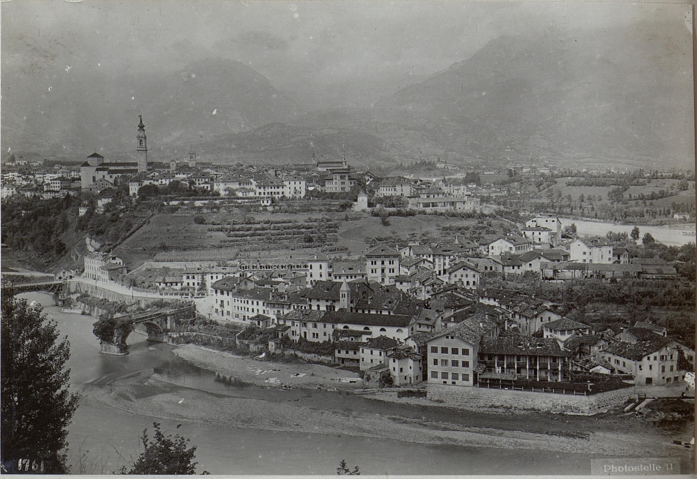

*Belluno, di Rudio's birthplace in the Veneto — photographic panorama, 1918. Austrian National Library / Bildarchiv Austria (via Wikimedia Commons); public domain.*

**The Spielberg.** The fortress-prison di Rudio names as the emblem of Austrian repression, where Italian patriots languished and died in its underground cells. *(P1 Ch. 2, pp. 15–23)*

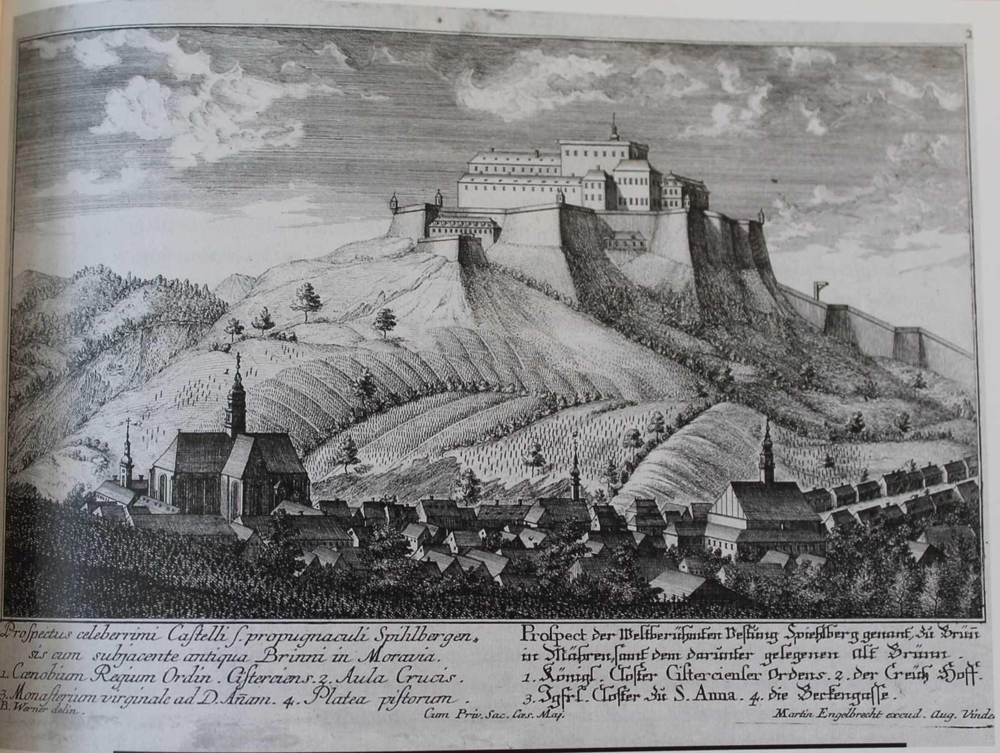

*The Špilberk (Spielberg) fortress above Brno, Moravia — copper engraving by Martin Engelbrecht, 1736. Wikimedia Commons; public domain.*

> **Historical note** — The Spielberg (Czech *Špilberk*) is a hilltop castle in Brno, Moravia, used by the Habsburgs as a prison for Italian patriots; Silvio Pellico's memoir *Le mie prigioni* (1832), written about his confinement there, made it a byword for Austrian tyranny across the Risorgimento. *(Source: Wikipedia, "Špilberk Castle".)*

**The Quadrilateral.** The four Austrian fortresses anchoring control of Lombardy-Venetia and the Veneto plain — the position Radetzky fell back on after the Five Days, and (di Rudio notes bitterly) the prize Villafranca left in Austrian hands in 1859. *(P2 Ch. 31, pp. 253–258)*

> **Historical note** — The "Quadrilateral" was the defensive system formed by the fortresses of Verona, Legnago, Mantua, and Peschiera, which let Austria dominate the Veneto plain throughout the wars of independence. *(Source: Wikipedia, "Quadrilatero".)*

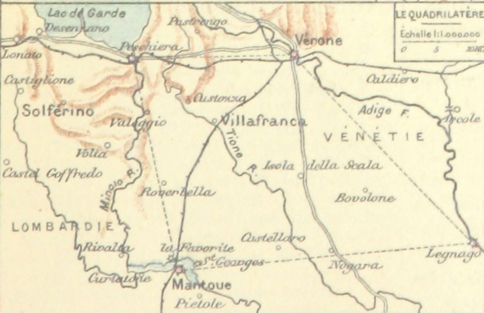

*"Le quadrilatère" — a period map of the Austrian fortress system (Verona, Legnago, Mantua, Peschiera). British Library (via Wikimedia Commons); public domain.*

**Villa Corsini.** The villa on the Janiculum heights above Rome — "the key to Porta San Pancrazio" — fought over in the day-long, doomed assaults of 3 June 1849, the book's set piece of heroic slaughter. *(P1 Ch. 6, pp. 34–39; see [Event Context §3](events.md#3-the-roman-republic-and-its-siege-1849))*

**Castello di San Giorgio, Mantua.** The Austrian prison-fortress at Mantua where Calvi was held with di Rudio's father, his sister Luisa, and Don Bastiano, and where Orsini too was briefly jailed — the same fortress-prison that held the Belfiore martyrs (executed 1852–55; see [Event Context §5](events.md#5-the-conspiratorial-decade--giovine-italia-the-1853-rising-and-the-belfiore-martyrs)). *(P1 Ch. 22, pp. 108–112)*

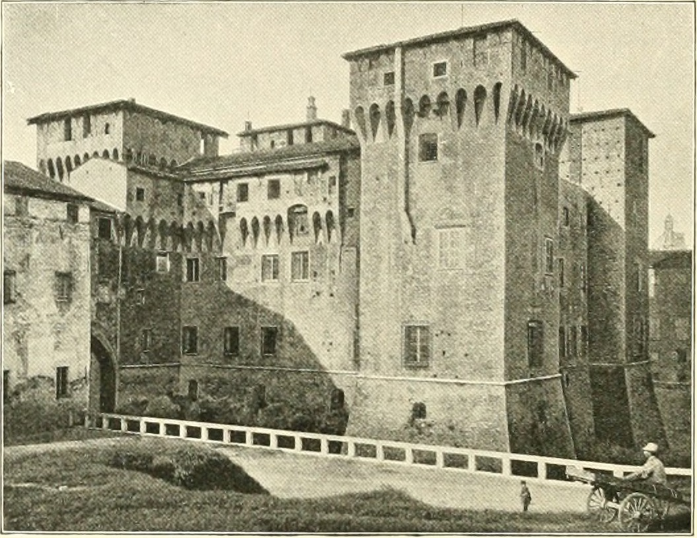

*The Castello di San Giorgio, Mantua — period view, 1896. Internet Archive (via Wikimedia Commons); public domain.*

> **Historical note** — Orsini's imprisonment and escape here are well documented: arrested by the Austrians in December 1854, he sawed through his cell bars on the night of 29–30 March 1856, lowered himself down the fortress wall on a rope of knotted bedding, and escaped to England, where he told the story in *The Austrian Dungeons in Italy* (1856). *(Sources: Orsini, *The Austrian Dungeons in Italy*, 1856; Britannica, "Felice Orsini".)*

**Osoppo.** The Friulian fortress di Rudio's Alpine plan meant to seize and hold as an insurgent base. *(P1 Ch. 17, pp. 83–88)*

**San Marino.** The independent republic where di Rudio took refuge after the fall of Rome in 1849. *(P1 Ch. 7, pp. 39–43)*

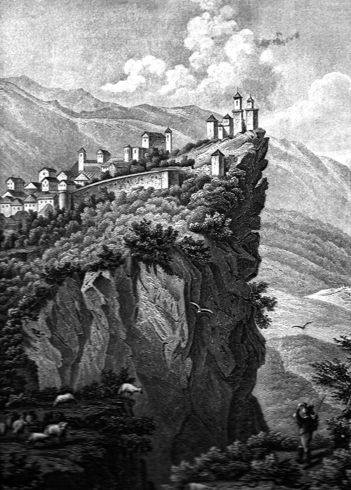

*The hilltop Republic of San Marino on Monte Titano — period view, c. 1855. Wikimedia Commons; public domain.*

**Rue Le Peletier (the Opéra).** The street before the old Paris opera house where the *attentat* was carried out on 14 January 1858; di Rudio and Orsini took their post across from the theatre by the *Broggi* trattoria, and it was here di Rudio threw the second bomb at the imperial carriage. *(P2 Ch. 8, pp. 157–160; P2 Ch. 10, pp. 163–165)*

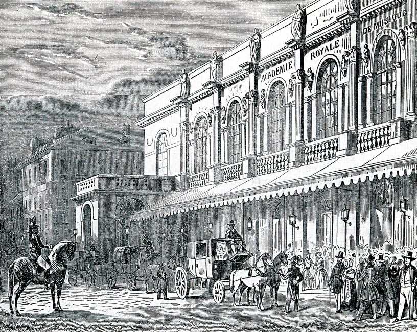

*The Salle Le Peletier, the Paris Opéra on the Rue Le Peletier (1821–1873), outside which the attentat took place — engraving by A. Provost, 1844. Wikimedia Commons; public domain.*

> **Historical note** — The house was the Salle Le Peletier, home of the Paris Opéra from 1821 until it burned down on the night of 28–29 October 1873. The attack outside it prompted Napoleon III to commission a new, more secure opera house — the Palais Garnier, inaugurated 1875. *(Sources: Opéra de Paris official history; Wikipedia, "Salle Le Peletier".)*

**Mazas.** The Paris remand prison to which di Rudio was committed for trial after the Orsini bombing, held among planted police informers. *(P2 Ch. 13–14, pp. 173–183)*

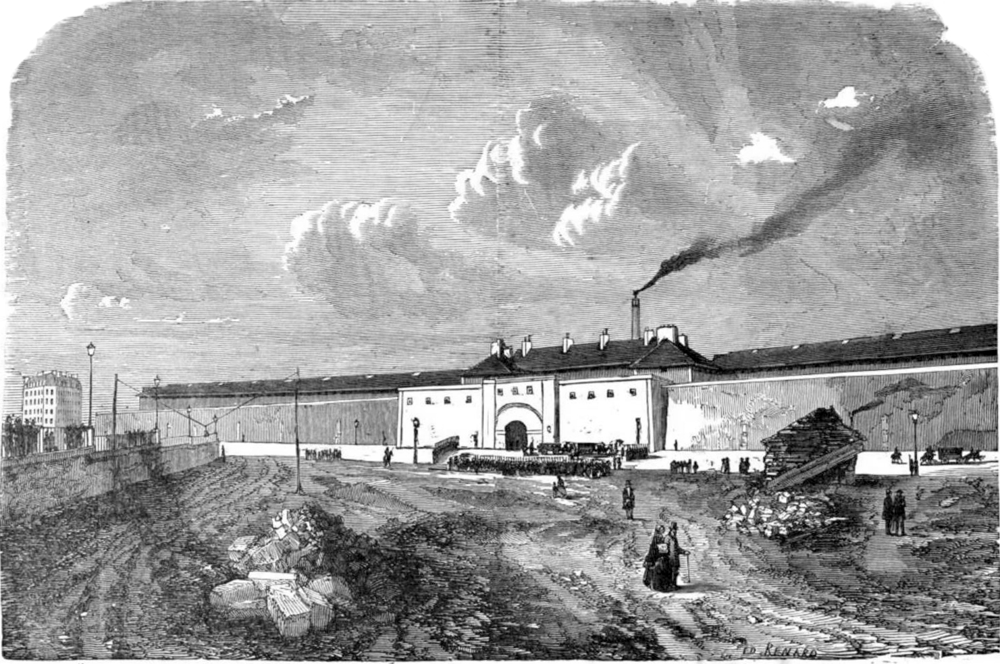

*The cellular Prison Mazas, Paris (opened 1850, demolished 1900) — wood engraving, 1882. Wikimedia Commons; public domain.*

> **Historical note** — Mazas, near the Gare de Lyon, was a large cellular remand prison opened in 1850 on the "Pennsylvania" model of solitary confinement in separate cells; it was demolished in 1898 ahead of the 1900 Universal Exposition. *(Source: Wikipedia, "Mazas Prison".)*

**The Conciergerie.** The historic Paris prison to which the four conspirators were moved for trial, held in adjacent cells — di Rudio in No. 1, Pieri No. 2, Gomez No. 3, Orsini No. 4. *(P2 Ch. 14–17, pp. 178–195)*

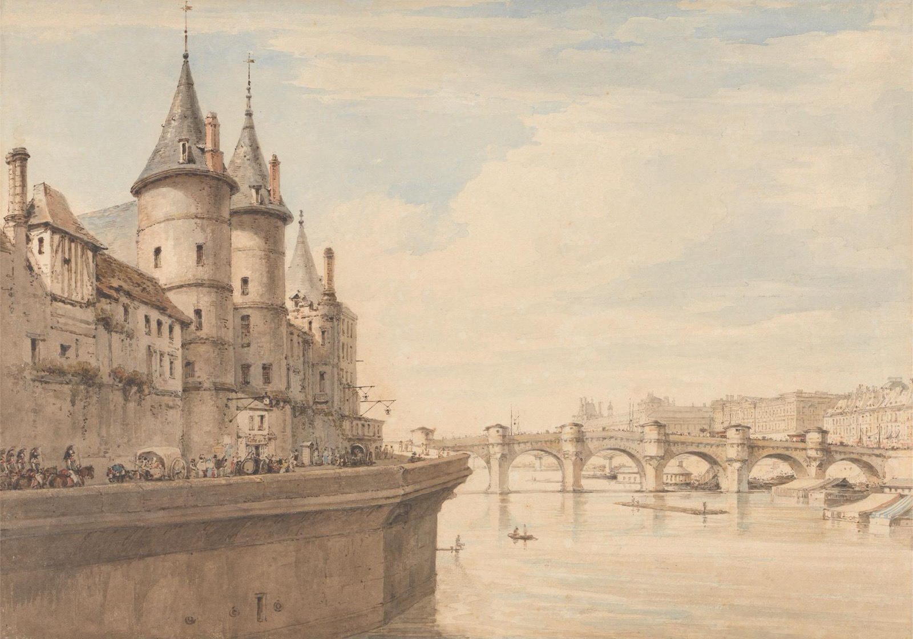

*The Conciergerie on the Île de la Cité — watercolour view by Henry Edridge, 1818. Yale Center for British Art (via Wikimedia Commons); CC0 (public domain).*

> **Historical note** — The Conciergerie, the medieval former royal palace on the Île de la Cité, is most infamous as the antechamber of the guillotine during the Revolutionary Terror of 1793–94, when Marie Antoinette and thousands of others were held there before execution; it remained in use as a prison until 1934. *(Source: Wikipedia, "Conciergerie".)*

**La Roquette.** The Paris prison of the condemned, where the three death-sentenced conspirators were held in straitjackets within sight of one another and the scaffold was raised before the door; di Rudio was reprieved here at the foot of the guillotine. *(P2 Ch. 18–20, pp. 196–210)*

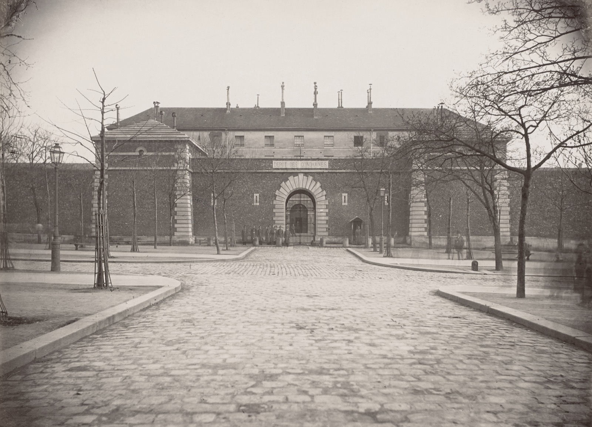

*The Grande Roquette, the Paris prison of the condemned — photograph by Auguste Hippolyte Collard, c. 1876–80. Wikimedia Commons; public domain.*

> **Historical note** — The Grande Roquette, in Paris's 11th arrondissement, was the prison of the condemned — holding both those awaiting execution and convicts bound for the penal colonies. From 1851 to 1899, public guillotinings took place just outside, on the Place de la Roquette, the scaffold seated on five granite slabs set in the pavement (nicknamed *l'abbaye des cinq-pierres*, and still visible today). It was here, at about seven in the morning of 13 March 1858, that Felice Orsini and Giuseppe Pieri were beheaded for the attack on Napoleon III — the execution from which di Rudio was spared at the last moment. The prison was demolished in 1900. *(Sources: Wikipedia, "La Roquette Prisons"; ExecutedToday, "1858: Felice Orsini".)*

**Toulon.** The Mediterranean naval bagne where the condemned were held before transportation to the tropics; di Rudio was chained in a sea-level casemate here from April 1858, plotting a first, aborted escape, until he was shipped to Guiana. *(P2 Ch. 21, pp. 212–215)*

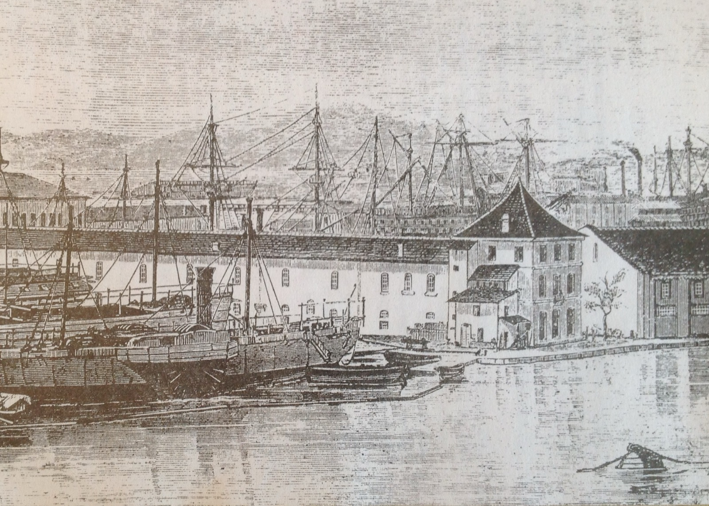

*The bagne (convict port) of Toulon — mid-19th-c. engraving. Wikimedia Commons; public domain.*

**Cayenne.** The capital of French Guiana, and in the book the shorthand for its whole penal colony — the convict's dreaded destination, "the dry guillotine of Cayenne." di Rudio's two stations within it were the Montagne d'Argent and the Île du Salut. *(P2 Ch. 21–23, pp. 212–225)*

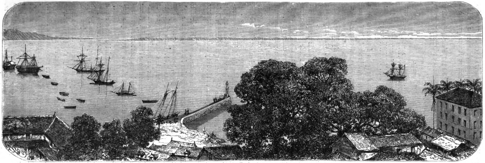

*The harbour of Cayenne, capital of French Guiana — wood engraving after Édouard Riou, 1866 (Le Tour du monde). Wikimedia Commons; public domain.*

**Montagne d'Argent.** A former plantation turned penal station in French Guiana, near the Brazilian frontier, where di Rudio landed on 11 December 1858 and where yellow fever killed all but sixty-three of more than six hundred convicts — his eight escape-plot accomplices among the dead. *(P2 Ch. 22, pp. 216–222)*

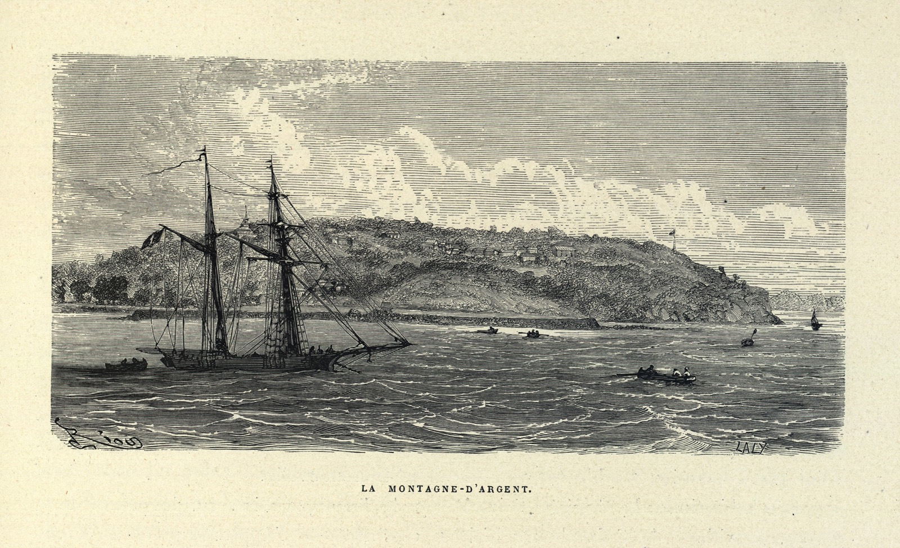

*The Montagne d'Argent penal station, French Guiana — engraving after Édouard Riou, 1867. Wikimedia Commons; public domain.*

**Île du Salut / Îles du Salut.** The "Salvation Islands" off the Guiana coast, the penal archipelago to which the fever survivors were evacuated and from which di Rudio staged his successful escape by sea in December 1859. *(P2 Ch. 23–25, pp. 222–232)*

> **Historical note** — The Îles du Salut comprise Île Royale, Île Saint-Joseph, and the Île du Diable ("Devil's Island"), the most notorious unit of the French penal colony of Guiana (the *bagne de Cayenne*), established by Napoleon III's decree in 1852 and operated until the 1950s. The same archipelago would later hold Captain Alfred Dreyfus in isolation (1895–1899) during the Dreyfus Affair, and became known to modern readers as the setting of Henri Charrière's bestselling *Papillon* (1969). *(Sources: Wikipedia, "Devil's Island"; dreyfus.culture.fr.)*

---

## Organizations, societies & military units

**Carbonari.** The early-nineteenth-century secret society of "charcoal-burners" whose distrust of Louis-Napoleon di Rudio invokes — the conspiratorial seedbed that preceded Mazzini's movement. *(P1 Ch. 5, pp. 31–34)*

> **Historical note** — The Carbonari were a network of secret revolutionary societies active in Italy from about 1800, central to the failed risings of 1820–21 and 1831; Mazzini was himself initiated as a Carbonaro before founding Young Italy. *(Source: Wikipedia, "Carbonari".)*

**Giovine Italia (Young Italy).** Mazzini's movement, into which di Rudio is sworn at Marseilles after the fall of Rome; membership defines his politics for the rest of the book — a unified Italian *republic*, by insurrection, against both Austria and the native monarchy. *(P1 Ch. 8, pp. 43–48)*

> **Historical note** — Mazzini founded *Giovine Italia* in 1831 to work for a free, unified, republican Italy through popular insurrection. *(Source: Wikipedia, "Young Italy".)*

**European Revolutionary Committee.** The London-based coordinating body founded by Mazzini, Kossuth, and Ledru-Rollin; its Turin branch commissioned di Rudio as a secret envoy into Lombardy-Venetia, and it was Calvi's commission from this committee that hanged him. *(P1 Ch. 11, pp. 59–62; P1 Ch. 22, pp. 108–112)*

> **Historical note** — The body was the **Central European Democratic Committee** (*Comité central démocratique européen*), founded in London in July 1850 by Mazzini, Ledru-Rollin, the German Arnold Ruge, and the Pole Albert Darasz as the first international organization of the European democratic left. Ledru-Rollin was indeed a co-president with Mazzini; Kossuth, whom the memoir names as a founder, joined the circle only after reaching England in 1852. *(Sources: Revue d'histoire du XIXe siècle; standard biographies of Mazzini and Kossuth.)*

**The Secret Committee.** The shadowy London body that financed and directed the Orsini plot — it first granted di Rudio's wife fourteen shillings a week, then abruptly relieved di Rudio of any role for being a family man. *(P2 Ch. 5, pp. 144–148)*

**The Fratellanza.** The Milanese workers' secret brotherhood, organized by the dyer Assi, that di Rudio insists actually began the 1853 rising — his evidence that the insurrection was a popular act, not Mazzini's reckless folly. *(P1 Ch. 13, pp. 67–74)*

**The Military and Mixed Commissions.** The closed-door tribunals Louis-Napoleon set up after his December 1851 coup; di Rudio describes them condemning men in absentia from prepared lists — a mark beside each name to acquit, deport to Lambesa (the Algerian penal colony), or send "to the dry guillotine of Cayenne." *(P1 Ch. 9, pp. 48–52)*

> **Historical note** — The *commissions mixtes* (February 1852) were real: secret departmental tribunals of a prefect, a general, and a public prosecutor that judged some 26,000–27,000 opponents of the coup on paper, without their appearing — sentencing roughly 9,500 to Algeria (chiefly the penal colony of Lambèse, the memoir's "Lambesa") and a few hundred to Guiana. di Rudio's account of marked lists and triage is accurate in substance, though his "forty thousand families" overstates the documented figure. *(Sources: poursuivis-decembre-1851.fr; Wikipedia, "French coup d'état of 1851".)*

**Bersaglieri.** Italy's elite light-infantry sharpshooters, who appear on both sides of the book's sympathies: Manara's republican Bersaglieri cut down at the Villa Corsini in 1849, and the royal Bersaglieri who fired on Garibaldi at Aspromonte in 1862. di Rudio twice refuses a Piedmontese Bersaglieri commission rather than swear to the monarchy. *(P1 Ch. 6, pp. 34–39; P1 Ch. 8, pp. 43–48; P2 Ch. 31, pp. 253–258)*

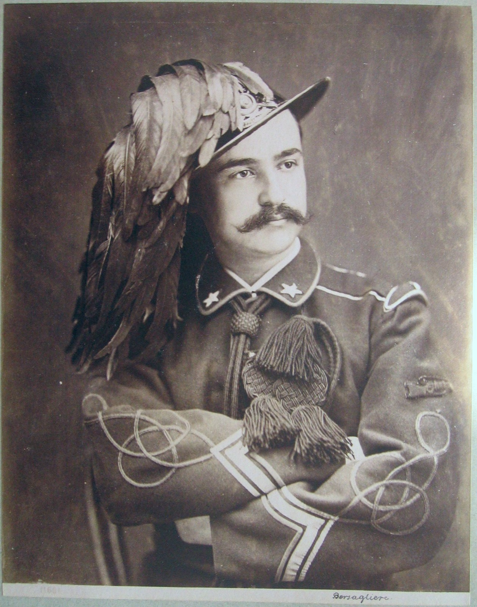

*A Bersagliere in the corps' plumed hat — photograph by Giorgio Sommer, Naples, c. 1860s. Wikimedia Commons; public domain.*

> **Historical note** — The Bersaglieri are a high-mobility marksman corps of the Italian army, founded in the Piedmontese-Sardinian army in 1836 and distinguished by their plumed wide-brimmed hats. *(Source: Wikipedia, "Bersaglieri".)*

**Cacciatori delle Alpi.** The book applies this name ("Hunters of the Alps") to the volunteer corps under Pietro Fortunato Calvi that di Rudio and his brother Achille joined in the defense of Venice in 1848–49. *(P1 Ch. 4, pp. 26–31)*

> **Historical note** — The famous formation of this name, the *Cacciatori delle Alpi*, was the volunteer corps Garibaldi led in the 1859 Second War of Independence. The memoir uses the term for Calvi's earlier 1848–49 Venetian volunteers; the two should not be confused. *(Source: Wikipedia, "Hunters of the Alps".)*

---

## Terms, objects & phrases

**"Human document."** Crespi's own term, in the preface, for what the book is: not a methodical history but living testimony that captures "the soul of the times" — its method being di Rudio's written approval of every chapter and his signature on contestable pages. *(Prefazione, pp. 7–8; see [Themes §1](themes.md#1-testimony-as-method--the-human-document))*

> **Historical note** — The phrase renders a term of art from literary naturalism: *document humain*, claimed by Edmond de Goncourt in his 1882 preface to *La Faustin* and taken up in Italy by the Veristi (Capuana, Verga) for a work grounded in direct, near-documentary observation of real life rather than methodical invention — precisely the contrast Crespi draws. *(Sources: Goncourt, preface to *La Faustin*, 1882; standard accounts of Verismo.)*

**The Orsini "hedgehog" bombs.** The novel bombs studded with spikes, each tipped with a percussion cap so they would detonate however they fell ("in the form of a hedgehog") — devised by Baron Egassy di Torocfalda, cast piece by piece "in the guise of gas-fittings" by the Taylor foundry in Birmingham, and charged with mercury fulminate. Orsini called the twelve to be cast his "twelve apostles." Three were thrown outside the Opéra on 14 January 1858. *(P2 Ch. 6, pp. 149–152; P2 Ch. 7, pp. 154–156)*

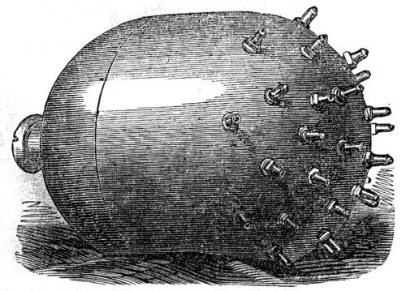

*The Orsini "hedgehog" bomb — engraving from the Illustrated London News, 27 February 1858. Wikimedia Commons; public domain.*

> **Historical note** — The device is the historically documented "Orsini bomb," and the memoir's manufacturing detail checks out: the castings were made in Birmingham by the gun engineer **Joseph Taylor** (the book's "Taylor foundry") and tested in England before being smuggled to France. The designer the book calls "Baron di Torocfalda," however, cannot be traced in the historical record; the design is usually credited to Orsini himself. *(Sources: Wikipedia, "Orsini bomb"; History Today, "Felice Orsini".)*

**Mercury fulminate.** The primary explosive charging the Orsini bombs — the damp powder di Rudio spreads on a newspaper in Orsini's lodgings while Orsini judges its moisture by fingertip and takes the dangerous drying upon himself. *(P2 Ch. 7, pp. 154–156)*

> **Historical note** — Mercury fulminate is a highly sensitive primary explosive, the standard percussion-cap detonator of the nineteenth century; its instability is what made the conspirators' handling of it so lethal. *(Source: Wikipedia, "Mercury(II) fulminate".)*

**The "dry guillotine."** *La guillotine sèche* — the convicts' name for transportation to the penal colony of Guiana, a death sentence by tropical disease rather than the blade. di Rudio uses the phrase both for the deportations after Louis-Napoleon's coup and for his own sentence to Cayenne. *(P1 Ch. 9, pp. 48–52; P2 Ch. 21–22, pp. 212–222)*

> **Historical note** — The phrase, already current in di Rudio's day, was fixed in popular usage by escaped convict René Belbenoît's 1938 book *Dry Guillotine*, about the same Guiana penal system. *(Source: Wikipedia, "Devil's Island".)*

**Vase.** The treacherous coastal mud-flats of the Guianas — the soft, crab-infested tidal mud that trapped and doomed earlier escapees (among them the son of Giacomo Pianori) and nearly swallowed di Rudio's own canoe until the rising tide freed it. *(P2 Ch. 23, pp. 222–225; P2 Ch. 26, pp. 232–235)*

**"O Roma o morte" ("Rome or death").** Garibaldi's banner-slogan in the 1862 march on Rome that ended at Aspromonte; di Rudio defends the banner against an Irish mob at the London protests it set off. *(P2 Ch. 31, pp. 253–258; P2 Ch. 33, pp. 264–268; see [Event Context §9](events.md#9-aspromonte-1862))*

**"Dio e Popolo" ("God and the People").** The Mazzinian motto on the banner that touched off the deadly Genoa cemetery riot di Rudio witnessed after the fall of Rome — the watchword of Young Italy's fusion of faith and republic. *(P1 Ch. 8, pp. 43–48)*

**"Re Bomba" ("King Bomb").** The derisive nickname for Ferdinand II, King of the Two Sicilies, whose Neapolitan troops di Rudio fought at Palestrina in 1849. *(P1 Ch. 5, pp. 31–34; P1 Ch. 6, pp. 34–39)*

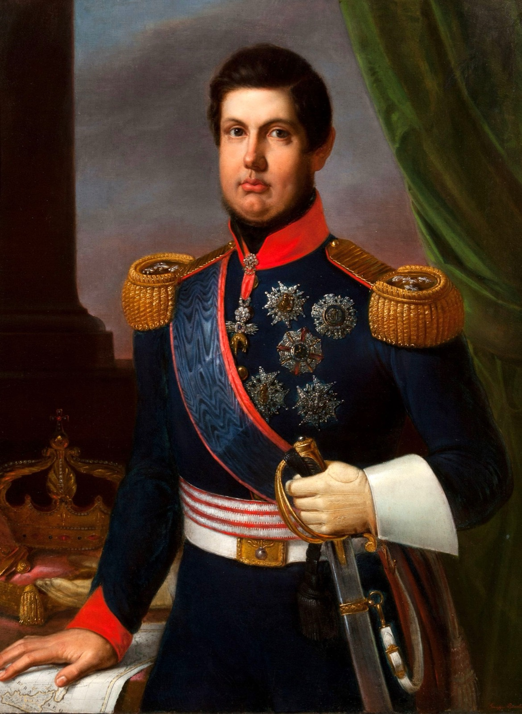

*Ferdinand II of the Two Sicilies, "Re Bomba" — portrait by Giuseppe Bonolis, 1835. Reggia di Caserta (via Wikimedia Commons); public domain.*

> **Historical note** — Ferdinand II of the Two Sicilies earned the epithet "Re Bomba" for his heavy bombardment of his own cities, notably Messina, during the 1848 revolutions. *(Source: Wikipedia, "Ferdinand II of the Two Sicilies".)*

---

## Ships

**Radetzky.** The Austrian steamship on Lake Maggiore that Calvi's 1853 scheme meant to seize as the spark of an Alpine rising; di Rudio scouted her before the plan collapsed. *(P1 Ch. 13, pp. 67–74)*

> **Historical note** — The steamer was real: an Austrian Lloyd paddle steamer on Lake Maggiore in the 1850s, based with the Austrian lake flotilla at Laveno and later renamed *Sirmione* and moved to Lake Garda (1862). The Mazzinian plan to seize her is not independently attested, but it echoes Garibaldi's documented 1848 seizure of Lake Maggiore steamers to land troops at Luino. *(Sources: A. Cherini, "La navigazione a vapore sui laghi italiani"; Verbania Risorgimento museum.)*

**La Durance.** The French frigate that carried di Rudio as a convict across the Atlantic to the Guiana penal colony in 1858. *(P2 Ch. 21–22, pp. 212–222)*

> **Historical note** — di Rudio's transport ship is not independently identified in the historical record. A French naval *Durance* of the period existed, but had become a stationary prison hulk at Cayenne (renamed *Le Gardien*) by 1855 — so the name in the memoir, written from decades-old recollection, may be a misremembering. *(Source: histories of the French Guiana penal colony.)*

**Abeille.** The French naval vessel based at the Guiana colony — supply ship, prison ferry between Cayenne and the islands, and the pursuer di Rudio's escape party had to outrun. *(P2 Ch. 22–27, pp. 216–240)*

> **Historical note** — A French steam aviso named *Abeille* is documented on the Cayenne station in exactly this period: its logbooks survive in the Service Historique de la Défense from April 1859, and the *Bulletin officiel de la Guyane française* places it at Cayenne with named officers in early 1860. The specific pursuit and ferry duties the book gives her are plausible for such a vessel but are not otherwise attested. *(Sources: Service Historique de la Défense; Bulletin officiel de la Guyane française, 1860.)*

**Amazzone.** The French frigate that put in at the Île du Salut in 1859 with news of the victory at Magenta — and the amnesty decree that, applying to French subjects only, stripped di Rudio's escape party of three Italian members who chose to petition the Emperor instead. *(P2 Ch. 25, pp. 228–232)*

> **Historical note** — This is the French frigate *Amazone* — laid down at Brest in 1845, launched in 1858 after conversion to a steam transport, and a principal convict carrier to French Guiana; she made a documented voyage there in May–June 1859, the very window in which news of Magenta (4 June 1859) would have reached the colony. *(Sources: French naval registry, shipscribe.com; histories of the French Guiana penal colony.)*

**John Romelly.** The English brig (Captain Kandel) on which di Rudio, entered on the ship's roll as a crewman to evade a French spy, sailed from the Berbice in British Guiana and reached London on 29 February 1860 — the close of his escape and the start of what he called his "second existence." *(P2 Ch. 28, pp. 240–245)*

> **Historical note** — Confirmed in Lloyd's Register of Shipping for 1860 and 1861: the brig *John Romilly*, 230 tons, built at Bridport in 1835, owned by Jolly & Co. of London, master **R. Kendall** — so the memoir's "John Romelly" under "Captain Kandel" was a real English vessel, the captain's name properly Kendall. The specific Berbice-to-London crossing rests on di Rudio's own testimony. *(Sources: Lloyd's Register of Shipping, 1860 & 1861; Dorset History Centre.)*

**Virginia.** The steamship on which di Rudio sailed from Liverpool for New York on 8 February 1864 — the book's closing image of departure. *(P2 Ch. 33, pp. 264–268)*

> **Historical note** — A steamship *Virginia* did run Liverpool–Queenstown–New York in this period — built 1863, operated by the National Steam Navigation Company, later rebuilt as the *Greece*. di Rudio's 1864 emigration is confirmed by his biographers, but no independent source names his ship or the exact sailing date of 8 February 1864; those derive from the memoir alone. *(Sources: maritime records, norwayheritage.com and ggarchives.com; DeRudio biographies.)*
