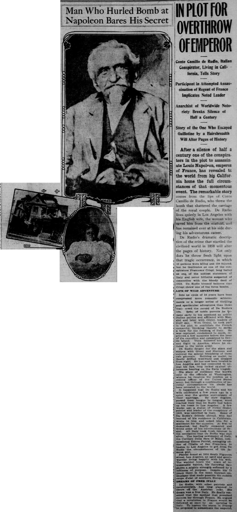
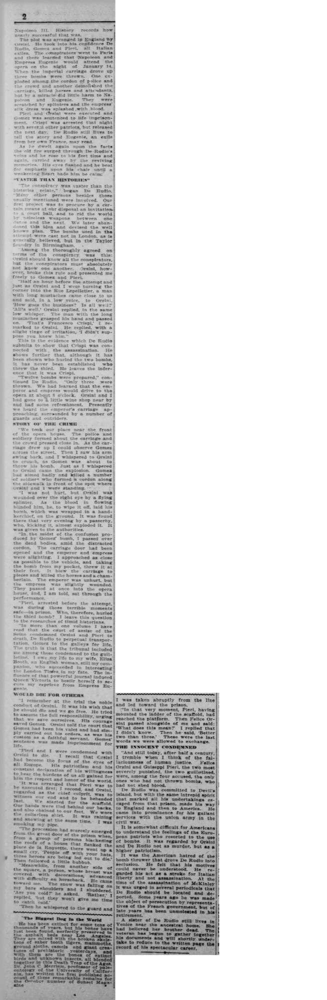

# "In Plot for Overthrow of Emperor" — *San Francisco Call*, 29 September 1908

A transcription of the feature interview in which Count Carlo (here "Camillo") di Rudio first told his story to the press — five years before *Per la libertà!* and the source of the "revelations" the [30 September follow-up](../themes.md#1-testimony-as-method--the-human-document) was defending. It is di Rudio's **own 1908 account**, and it diverges in places from the 1913 book and from the historical record (e.g. it collapses his Guiana imprisonment into "Devil's Island," and gives the bombing toll as "10 persons killed and 150 injured"). It is reproduced here as a primary source, not as corrected fact.

**Citation:** "In Plot for Overthrow of Emperor — Man Who Hurled Bomb at Napoleon Bares His Secret," *San Francisco Call*, 29 September 1908, p. 1 (continued p. 7). Public domain (1908 US publication).

> **Transcriber's note.** Transcribed from the clipped page images below. The scan resolution leaves a few words at the edge of legibility; these are marked `[?]`. Spelling and punctuation follow the original (including "Camillo," "Giuseppi Pieri," and "Lepelletier").

---

## Transcription

### [Front page]

**Man Who Hurled Bomb at Napoleon Bares His Secret**

**IN PLOT FOR OVERTHROW OF EMPEROR**

*Conte Camillo de Rudio, Italian Conspirator, Living in California, Tells Story*

*Participant in Attempted Assassination of Regent of France Implicates Noted Leader*

*Anarchist of Worldwide Notoriety Breaks Silence of Half a Century*

*Story of the One Who Escaped Guillotine by a Hairsbreadth Will Alter Pages of History*

After a silence of half a century one of the conspirators in the plot to assassinate Louis Napoleon, emperor of France, has revealed to the world from his California home the full circumstances of that momentous event. The remarkable story comes from the lips of Conte Camillo de Rudio, who threw the bomb that shattered the carriage of the royal couple. De Rudio lives quietly in Los Angeles with his English wife, the woman who saved him from the scaffold, and has remained ever at his side during his adventurous career.

De Rudio's dramatic description of the crime that startled the civilized world in 1858 will alter the pages of history. Not only does he throw fresh light upon that tragic occurrence, in which 10 persons were killed and 150 injured, but he implicates as one of the conspirators Francesco Crispi, long hailed as one of the noblest statesmen of Italy and never hitherto suspected of connection with the bloody deed of 1858. De Rudio himself believes that Crispi threw one of the three bombs.

#### LIFE OF WILD ADVENTURE

Into no cycle of 50 years have been compressed more romantic achievements or a longer series of thrilling and spectacular adventures than those that crowd the record of De Rudio's life. Born of noble parents he became early in his manhood an ardent Italian patriot and affiliated with Mazzini and later with Orsini, leaders of their day. With Orsini, he took part in the plot to annihilate the French monarchy, thinking thereby to strike a blow for the freedom of Italy. He was captured, condemned to death, reprieved a few moments before the hour of the execution and committed to Devil's island. Then followed his escape and flight to America, where he enlisted in the union army.

De Rudio fought for the stars and stripes with Grant and Sherman and enjoyed the special friendship of these two generals. Retiring as major, he finally drifted westward and dropped from sight. He has now been located in Los Angeles and has consented to unseal his lips, long locked against utterances bearing on the Paris tragedy.

His place of residence was known only to the officials at Washington, whence he receives his pension as a retired officer of the United States army, but through a combination of peculiar circumstances his abode has been revealed to the world.

It happened that De Rudio and his wife celebrated a few years ago in a quiet way the golden anniversary of their marriage. By slow degrees, passed from tongue to tongue, word reached Italy that De Rudio had taken up his home in Los Angeles. A few weeks ago a statue of Felice Orsini, patriot and leader of the conspiracy of 1858, was unveiled in Italy. Some of De Rudio's friends abroad, who had learned of his residence in California, wrote to him and asked him for a sentiment for the occasion. At first he demurred, but finally consented and wrote some of his recollections of Orsini. All Italy took fresh interest in the revelation that De Rudio was still alive. The leading newspaper of Italy, the Corriere Della Sera of Milan, commissioned Ettore Patrizi, managing editor of l'Italia of San Francisco, to hasten to Los Angeles to get from De Rudio the circumstances of the famous plot.

Patrizi found at 1034 South Figueroa street, Los Angeles, an aged and gentle warrior living happily with his wife. The warrior bears the scars of innumerable battles, his furrowed face shows a mighty strength softened by a loftiness of purpose. Despite his 75 years there is the same buoyant enthusiasm that made possible the sudden coups d'etat of southern Europe.

#### DREAMS OF FREE ITALY

De Rudio, with other patriots and revolutionists, had long planned to throw off the Austrian yoke. His dream was a free Italy. He finally reasoned that the method that promised success lay through France. He argued that a revolution in France would be followed at once by an uprising in Italy. To hasten the storm in France he proposed to assassinate the emperor [continued p. 7] Napoleon III. History records how nearly successful that was.

### [Continued, page 7]

The plot was arranged in England by Orsini. He took into his confidence De Rudio, Gomez and Pieri, all Italian exiles. The conspirators went to Paris and there learned that Napoleon and Empress Eugenie would attend the opera on the night of January 14. When the imperial carriage drove up three bombs were thrown. One exploded among the cordon of police and the crowd and another demolished the carriage, killed horses and attendants, but by a miracle did little harm to Napoleon and Eugenie. They were scratched by splinters and the empress' silk dress was splashed with blood.

Pieri and Orsini were executed and Gomez was sentenced to life imprisonment. Crispi was arrested that night with several other patriots, but released the next day. De Rudio still lives to tell the story and Eugenie, an exile from her own France, may read.

As he dwelt again upon the facts the old fire surged through De Rudio's veins and he rose to his feet time and again, carried away by the reviving memories. His eyes flashed and he beat for emphasis upon his chair until a weakening heart bade him be calm.

#### "VASTER THAN HISTORIES"

"The conspiracy was vaster than the histories relate," began De Rudio. "Many other persons besides those usually mentioned were involved. Our first project was to procure by a certain means at our disposal an invitation to a court ball, and to rid the world by noiseless weapons between one dance and the next. We later abandoned this idea and devised the well known plan. The bombs used in the attempt were cast not in London, as is generally believed, but in the Taylor foundry in Birmingham.

"Among the thoroughly agreed on terms of the conspiracy was this: Orsini should know all the conspirators, but the conspirators must absolutely not know one another. Orsini, however, broke this rule and presented me freely to Gomez and Pieri.

"Half an hour before the attempt and just as Orsini and I were turning the corner into the Rue Lepelletier, a man with long mustaches came close to us and said, in a low voice, to Orsini, 'How goes the business? Is all well?' 'All's well,' Orsini replied, in the same low whisper. The man with the long mustaches grasped his hand and passed on. 'That's Francesco Crispi,' I remarked to Orsini. He replied, with a slight tinge of irritation, 'I didn't suppose you knew him.'"

This is the evidence which De Rudio submits to show that Crispi was connected with the assassination. He shows further that, although it has been shown who hurled the two bombs, it has never been established who threw the third. He leaves the inference that it was Crispi.

"Twelve bombs were prepared," continued De Rudio. "Only three were thrown. We had learned that the emperor and empress would drive to the opera at about 8 o'clock. Orsini and I had gone to a little wine shop near by and had some refreshment. Presently we heard the emperor's carriage approaching, surrounded by a number of guards and outriders.

#### STORY OF THE CRIME

"We took our place near the front of the opera house. The police and soldiery formed about the carriage and the crowd pressed close in. As the carriage drew up I could observe Gomez across the street. Then I saw his arm swing back, and I whispered to Orsini to crouch, as Gomez was about to throw his bomb. Just as I whispered to Orsini came the explosion. Gomez had aimed badly and killed a number of soldiers who formed a cordon along the sidewalk in front of the spot where Orsini and I were standing.

"I was not hurt, but Orsini was wounded over the right eye by a flying splinter. As the blood [was] flowing blinded him, he, to wipe it off, laid his bomb, which was wrapped in a handkerchief, on the ground. It was found there that very evening by a passerby, who, kicking it, almost exploded it. It was given to the authorities.

"In the midst of the confusion produced by Gomez' bomb, I passed over the dead bodies, amid the distracted cordon. The carriage door had been opened and the emperor and empress were alighting. I approached as close as possible to the vehicle, and taking the bomb from my pocket, threw it at their feet. It blew the carriage to pieces and killed the horses and a chamberlain. The emperor was unhurt, but the empress was slightly wounded. They passed at once into the opera house, and, I am told, sat through the performance.

"Pieri, arrested before the attempt, was during those terrible moments safe—in prison. Who, therefore, hurled the third bomb? I leave this question to the researches of timid historians.

"In more than one volume I have read that the court of assize of the Seine condemned Orsini and Pieri to death, De Rudio to perpetual transportation, Gomez to the galleys for life. The truth is that the tribunal included me among those condemned to the guillotine. I owe my life to my wife, Eliza Booth, an English woman, still my companion, who succeeded in interesting Queen Victoria in my fate. The influence of that powerful journal induced Queen Victoria to bestir herself to secure my reprieve from Empress Eugenie."

#### WOULD DIE FOR OTHERS

"I remember at the trial the noble conduct of Orsini. It was his wish that he should die and we go free. He tried to assume the full responsibility, urging that we save ourselves. His courage saved Gomez. Orsini told the court that Gomez had been his valet and had simply carried out his orders, as was his custom as a faithful servant. Gomez' sentence was made imprisonment for life.

"Pieri and I were condemned with Orsini to die. I recall that Orsini had become the focus of the eyes of all Europe. His patriotism and his constant declaration of his willingness to bear the burdens of us all gained for him the respect and honor of the world.

"It was arranged that Pieri was to be executed first; I second, and Orsini, regarded as the chief culprit, was to witness our end and to be beheaded last. We started for the scaffold. Our hands were tied behind our backs, and also chained to our feet. We wore the collarless shirt. It was raining and snowing at the same time. I was smoking my pipe.

"The procession had scarcely emerged from the great door of the prison when, from a group of persons blackening the roofs of a house that flanked the place de la Roquette, there went up a small cry, 'People, off with your hats, three heroes are being led out to die.' Then followed a little hubbub.

"Meanwhile, from another side of the square, a person, whose breast was covered with decorations, advanced with difficulty on horseback. He came toward me. The snow was falling on my bare shoulders and I shuddered. 'Are you cold?' he asked. 'Rather,' I replied, 'but they won't give me time to catch cold.'

"Then he whispered to the guard and I was taken abruptly from the line and led toward the prison.

"In that very moment, Pieri, having mounted the ladder of the scaffold, had reached the platform. Then Felice Orsini passed alongside of me and said: 'What does this mean?' I replied that I didn't know. Then he said, 'Better two than three.' These were the last words we were allowed to exchange."

#### THE INNOCENT CONDEMNED

"And still today, after half a century, I tremble when I think of the fallaciousness of human justice. Felice Orsini and Giuseppi Pieri, the two most secretly punished, the two guillotined, were, among the four accused, the only ones who had not thrown bombs, who had not shed blood."

De Rudio was committed to Devil's island, but with the same intrepid spirit that marked all his undertakings escaped from that prison, made his way to England and then to America. He came into prominence for his gallant services with the union army in the civil war.

It is somewhat difficult for Americans to understand the feelings of the European patriots who resorted to the use of bombs. It was regarded by Orsini and De Rudio not as murder, but as a higher patriotism.

It was the American hatred of the bomb thrower that drove De Rudio into seclusion. He felt that his motives could never be understood. He regarded his act as a stroke for Italian liberty and not assassination. At the time of the assassination of McKinley it was urged in several periodicals that De Rudio should be located and deported. Some years ago he was made the object of persecution by representatives of the French government, but of late years has remained unmolested in his retirement.

A sister of De Rudio still lives in Venice near the ancestral home. She had believed her brother dead. The veteran has begun to gather together his documents and will shortly undertake to reduce to the written page the record of his spectacular career.
