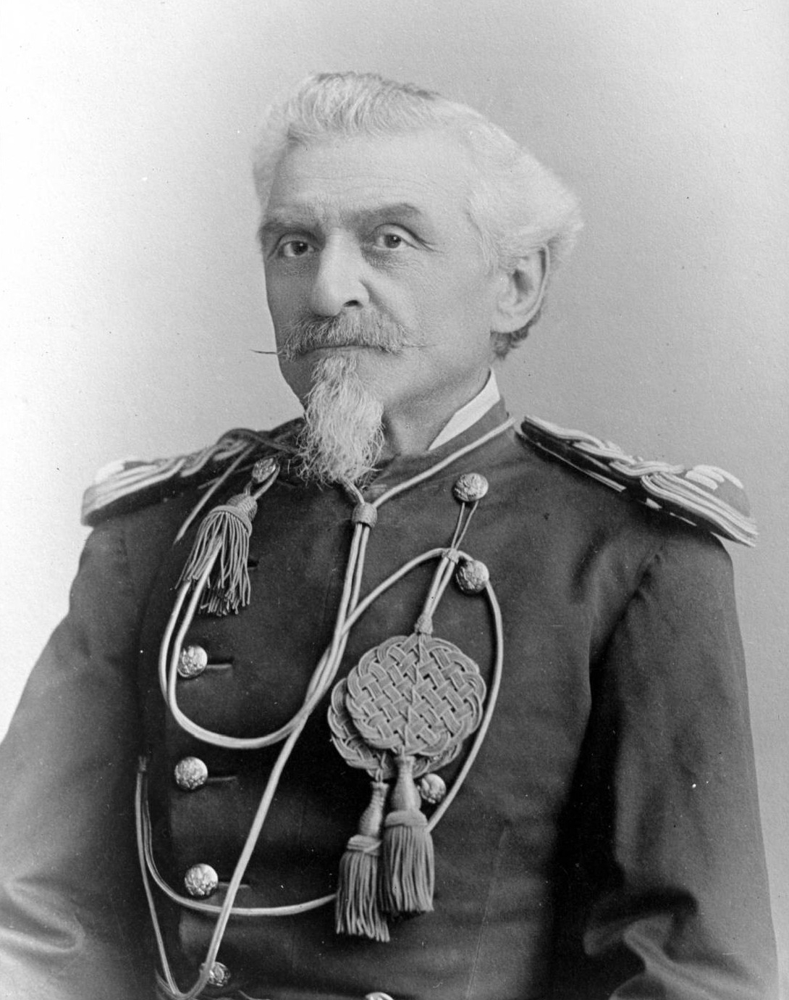

# Timeline

A dated spine of Carlo di Rudio's life **as the book tells it** (1832–1864), each entry cross-referenced to the chapter and source pages where it appears. External dates and corrections — including everything after the book's 1864 close — are set off as **Historical note** callouts (see [the index](index.md) for the convention). Where the book's date differs from the historical record, both are given.

This tracks di Rudio's life to his 1864 departure. The book's closing chapters (notably Part 2 Ch. 32) editorialize on later Italian history — Custoza and Lissa (1866), the taking of Rome (1870), and beyond — which postdates the narrative and is not itemized here.

Chapter references use the form *P1 Ch. 2 (pp. 15–23)*; pages are the source scan.

---

## Formation in Austrian Italy (1832–1848)

- **26 August 1832** — Born at Belluno to Count Ercole di Rudio and Countess Elisabetta de Domini, into an anti-papal aristocratic family. *(P1 Ch. 2, pp. 15–23)*
- **18 March 1848** — The Five Days of Milan; di Rudio is a cadet at the San Luca military academy as the city rises and Radetzky's Austrians retreat. *(P1 Ch. 2)*
- **1848** — Flight from Milan amid atrocities on the retreat to Verona; refuses an Austrian commission; joins Pietro Fortunato Calvi's corps at Venice, first glimpses Felice Orsini, and loses his brother Achille to pestilence. *(P1 Ch. 3–4, pp. 23–31)*

## The Roman Republic (1849)

- **March 1849** — At Venice, sides with the crowd in Piazza San Marco; Calvi quietly orders him to Rome. *(P1 Ch. 4)*
- **30 April 1849** — Reaches Rome with Garibaldi's Legion as Oudinot's French attack; the first assault is repulsed. *(P1 Ch. 4–6)*
- **9 May – 3 June 1849** — Fights at Palestrina and Velletri, then the savage battle for the Villa Corsini (3 June); escorts a captured French officer to safety from a mob. *(P1 Ch. 6, pp. 34–39)*
- **Late June – 1 July 1849** — The final French assault; di Rudio is captured, escapes by killing a sentry, is recaptured, court-martialed, and acquitted when a French officer argues he fought as a lawful combatant; escapes again toward San Marino. *(P1 Ch. 7, pp. 39–43)*
  > **Historical note** — The Roman Republic fell to the French in early July 1849 (the Assembly ceased resistance on 1 July; French troops entered Rome on 3 July), and Pope Pius IX was restored. *(Source: Wikipedia, "Roman Republic (1849)".)*

## First exile and the Paris coup (1849–1852)

- **1849** — Among the refugees at Genoa; refuses a Bersaglieri commission, declaring himself a Mazzinian; an attempt to sail for America is wrecked ashore at Cartagena; crosses Spain and swears Mazzini's oath at Marseilles, joining Giovane Italia. *(P1 Ch. 8, pp. 43–48)*
- **June 1851** — Reaches Paris. *(P1 Ch. 8)*
- **2 December 1851** — Louis-Napoleon's coup d'état; di Rudio mans a barricade in the Saint-Denis quarter. *(P1 Ch. 9, pp. 48–52)*
  > **Historical note** — Exactly one year later, on **2 December 1852**, the Second Empire was proclaimed and Louis-Napoleon became Napoleon III, Emperor of the French. *(Source: Wikipedia, "Second French Empire".)*
- **1851–52** — Escapes Paris disguised as a workman; harrowing passage into Switzerland. *(P1 Ch. 10, pp. 53–58)*

## Intelligence missions and the 1853 risings (1852–1853)

- **April 1852** — Working for a merchant tailor in Genoa, then on foot to Turin; reunited with the patriot priest Don Bastiano Barozzi and with Calvi, who commissions him a secret envoy to Lombardy-Venetia. *(P1 Ch. 11, pp. 59–62)*
- **1852** — Two intelligence missions into Austrian territory under the alias "Carlo Moretti," coding troop strengths as bales of silk. *(P1 Ch. 12, pp. 63–66)*
- **6 February 1853** — The Mazzinian Milan rising; di Rudio, carrying gold for Calvi's Lake Maggiore scheme, is diverted toward a parallel rising at Varese, then recalled — "In Milan all is lost." He meets Giuseppe Mazzini in person near Lugano. *(P1 Ch. 13–16, pp. 67–83)*
  > **Historical note** — The 6 February 1853 Milan insurrection followed the Austrian executions of the Belfiore martyrs (1852–53) and was suppressed within a day. *(Source: Wikipedia, "Belfiore martyrs".)*

## Alpine conspiracy, betrayal, and Calvi's death (1853–1855)

- **1853** — Expelled from Switzerland to England; gardens for the exile Pianciani; carries letters for Mazzini and Kossuth; undertakes Calvi's plan for an Alpine insurrection based on Belluno and the Osoppo fortress. *(P1 Ch. 17, pp. 83–88)*
- **1853** — Slips into Belluno; the night encounter beneath the chestnut tree where he nearly fires on his own mother; the conspiracy collapses; he hides with the peasant Domenico while his sister Luisa and father are arrested. *(P1 Ch. 18–19, pp. 88–98)*
- **1853** — His mother, shown a corpse said to be his, defiantly denies it is her son. *(P1 Ch. 20, pp. 99–100)*
- **17 September 1853** — Calvi is captured carrying his commission as general-in-chief. *(P1 Ch. 22, pp. 108–112)*
  > **Historical note** — Pietro Fortunato Calvi, the last of the Belfiore martyrs, was hanged at Mantua on **4 July 1855**. *(Source: Wikipedia, "Belfiore martyrs"; ExecutedToday.)*
- **December 1853** — Flees Zurich's hostile émigrés for Paris; labors fourteen-hour days. *(P1 Ch. 23, pp. 112–120)*
- **1854** — The Maloggia attempt to raise the Valtellina; he carves his initials "C. C. R." into a rifle stock that later convicts him; captured at Chur and **banished from Switzerland in perpetuity**, he returns to England. *(P1 Ch. 24, pp. 120–127)*

## London, marriage, and the road to the conspiracy (1855–1857)

- **mid-1850s** — Destitute in London's émigré world: the Drury Lane chorus, bottle-covering at the Wapping docks; teaches Italian to Sara Mancherini and her cousin Elisa, who secretly sustains him. *(P2 Ch. 1–2, pp. 127–136)*
- **9 December 1855** — Marries Elisa, the Englishwoman of the Mancherini household. *(P2 Ch. 3, pp. 136–141)*
- **1855–56** — Nearly killed intervening in the Rossi–Foschini affair; by the book's account Foschini later died with Carlo Pisacane in the failed Sapri expedition, which di Rudio reads as a sign of Mazzini's new southern strategy. *(P2 Ch. 4, pp. 142–143)*
- **September 1857** — In Nottingham, di Rudio aids a passing Italian exile who in turn mentions him to Felice Orsini at Birmingham; Orsini ("The very man I am looking for!") summons di Rudio to London by letter and revives the plan to kill Napoleon III. *(P2 Ch. 5, pp. 144–148)*

## The Orsini conspiracy (January 1858)

- **8 January 1858** — Leaves London, bidding a wrenching farewell to Elisa and their child. *(P2 Ch. 6, pp. 149–152)*
- **9 January 1858** — The steamer makes Calais twelve hours late (5 a.m.); he goes on by train to Paris on a Portuguese passport as "Giovanni da Sylva" (supplied by Simon Bernard), to find Orsini absent from the platform. *(P2 Ch. 7, pp. 154–156)*
- **12 January 1858** — Orsini walks the conspirators through the plan at the piazza of the Opéra. *(P2 Ch. 8, pp. 157–160)*
- **14 January 1858** — Outside the Opéra in the Rue Le Peletier, the bombs are thrown; Gomez throws the first prematurely, di Rudio the second. *(P2 Ch. 9–10, pp. 161–165)*
  > **Historical note** — Three bombs were thrown at the imperial carriage outside the Salle Le Peletier on the evening of **14 January 1858**; the Emperor and Empress were unhurt, but roughly eight people were killed and some 150 wounded. *(Source: Wikipedia, "Orsini affair".)*

## Trial, the scaffold, and the penal colony (1858–1859)

- **14 Jan – Feb 1858** — Arrested after a failed flight; sustains his false identity through interrogation until Antonio Gomez betrays that they know each other; committed to Mazas, then the Conciergerie. *(P2 Ch. 11–14, pp. 166–183)*
- **25–26 February 1858** — The trial; di Rudio, on his lawyer's advice, allows a defense portraying him as a youth led astray. All but Gomez (life) are condemned to death. *(P2 Ch. 15–17, pp. 184–195)*
- **11 March 1858** — The appeal to Cassation is rejected; the scaffold is built. *(P2 Ch. 18, pp. 196–201)*
- **13 March 1858** — Led barefoot toward the guillotine, di Rudio is halted at the last moment by the Empress's major-domo: his sentence is commuted. *(P2 Ch. 19–20, pp. 202–210)*
  > **Historical note** — Felice Orsini and Giuseppe Pieri were guillotined in Paris on **13 March 1858**; di Rudio's sentence was commuted to hard labor for life through petitions reaching the Empress Eugénie. *(Sources: Wikipedia, "Felice Orsini"; ExecutedToday.)*
- **April 1858** — Transferred to Toulon, in convict garb. *(P2 Ch. 21, pp. 212–215)*
- **11 December 1858** — Reaches the penal colony at the Montagne d'Argent, French Guiana. He prepares a canoe escape with eight accomplices, but a yellow-fever epidemic devastates the colony — of more than six hundred souls, sixty-three survive — and his eight fellow escape-plotters are among the dead he helps bury. *(P2 Ch. 22, pp. 216–222)*

## Escape and vindication (1859–1862)

- **1859** — On the Île du Salut, plans an escape built on his predecessors' failures: seize the fishing boat, scuttle the pursuit craft. *(P2 Ch. 23–25, pp. 222–232)*
- **9 December 1859** — Seizes the fishing boat; the gunboats, secretly scuttled, sink in pursuit; eleven men sail north into a storm. *(P2 Ch. 25–26, pp. 228–235)*
- **15 December 1859** — Reaches New Amsterdam, British Guiana; the Governor grants asylum and refuses French extradition. *(P2 Ch. 27, pp. 235–240)*
- **24 December 1859 → 29 February 1860** — Sails for England aboard the brig *John Romelly*, reaching London penniless. *(P2 Ch. 28, pp. 240–245)*
- **1860** — Clears his name of Simon Bernard's calumny that he bought his freedom by informing, vindicated by witnesses and Mazzini's published attestation; endures poverty and the death of an infant child. *(P2 Ch. 29–30, pp. 245–252)*
  > **Historical note** — Simon Bernard was tried in London in 1858 for his part in the Orsini plot and **acquitted** by the jury — against the judge's summing-up, with Edwin James for the defense — a celebrated case that strained Anglo-French relations. *(Source: Wikipedia, "Simon François Bernard".)*
- **1859–1861** — From exile, di Rudio follows the war in Italy — welcoming unification but condemning its terms, the reliance on Napoleon III and the cession of Nice and Savoy. *(P2 Ch. 31, pp. 253–258)*
  > **Historical note** — The Second War of Independence (1859) and Garibaldi's Expedition of the Thousand (sailed from Quarto, landed at Marsala, 1860) led to the **Kingdom of Italy, proclaimed 17 March 1861** — without Rome or Venetia. *(Sources: Wikipedia, "Expedition of the Thousand"; "Unification of Italy".)*

## Aspromonte and departure (1862–1864)

- **August 1862** — Aspromonte: royal troops halt Garibaldi's march on Rome and wound him. *(P2 Ch. 31, pp. 253–258)*
  > **Historical note** — The Battle of Aspromonte took place on **29 August 1862** (the book dates it 28 August). *(Source: Wikipedia, "Battle of Aspromonte".)*
- **1862–63** — Joins London protests for Rome; denied passage home by Consul Corti, who warns he would be handed to the French. *(P2 Ch. 33, pp. 264–268)*
- **early 1864** — A last meeting with the gravely ill Mazzini, who dissuades him from a Polish expedition and urges him toward the American war against slavery, furnishing letters of introduction. *(P2 Ch. 33)*
- **8 February 1864** — Sails from Liverpool aboard the *Virginia* for New York. **The book ends here.** *(P2 Ch. 33)*

## After the book (1864–1913)

*Carlo di Rudio's American afterlife: "Charles DeRudio," officer of the U.S. 7th Cavalry and a survivor of the Little Bighorn — photograph by D. F. Barry, c. 1870s. Wikimedia Commons (Denver Public Library); public domain.*

> **Historical note** — The memoir closes at di Rudio's emigration; his later life is documented outside it:
> - **1864** — Enlists as a private in the **79th New York Infantry**, serving at the Siege of Petersburg (25 August – 17 October 1864); on **11 November 1864** he is commissioned second lieutenant in the **2nd U.S. Colored Infantry**.
> - **14 July 1869** — Commissioned a second lieutenant in the **U.S. 7th Cavalry**.
> - **25–26 June 1876** — Survives the **Battle of the Little Bighorn**, stranded across the river and hiding some 36 hours with Private Thomas O'Neill after Major Reno's retreat, rejoining the command on 27 June.
> - **1 November 1910** — Dies at **Pasadena, California**, aged 78.
> - **1913** — Cesare Crespi publishes *Per la libertà!*, three years after di Rudio's death; the conversations behind it belong to the Count's final years.
>
> *(Source: Wikipedia, "Charles DeRudio".)*
